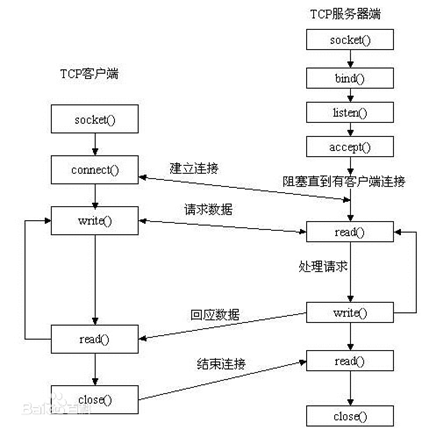

## 网络套接字函数

### 套接字概念

Socket本身有“插座”的意思，在Linux环境下，用于表示进程间网络通信的特殊文件类型。本质为内核借助缓冲区形成的伪文件。

既然是文件，那么理所当然的，我们可以使用文件描述符引用套接字。与管道类似的，Linux系统将其封装成文件的目的是为了统一接口，使得读写套接字和读写文件的操作一致。区别是管道主要应用于本地进程间通信，而套接字多应用于网络进程间数据的传递。

套接字的内核实现较为复杂，不宜在学习初期深入学习。

在TCP/IP协议中，“IP地址+TCP或UDP端口号”唯一标识网络通讯中的一个进程。“IP地址+端口号”就对应一个socket。欲建立连接的两个进程各自有一个socket来标识，那么这两个socket组成的socket pair就唯一标识一个连接。因此可以用Socket来描述网络连接的一对一关系。

套接字通信原理如下图所示：

​                                

套接字通讯原理示意

**在网络通信中，套接字一定是成对出现的。**一端的发送缓冲区对应对端的接收缓冲区。我们使用同一个文件描述符索发送缓冲区和接收缓冲区。

TCP/IP协议最早在BSD UNIX上实现，为TCP/IP协议设计的应用层编程接口称为socket API。本章的主要内容是socket API，主要介绍TCP协议的函数接口，最后介绍UDP协议和UNIX Domain Socket的函数接口。

  


### socket模型创建流程图

​                                

### socket函数

- socket()打开一个网络通讯端口，如果成功的话，就像open()一样返回一个文件描述符，应用程序可以像读写文件一样用read/write在网络上收发数据，如果socket()调用出错则返回-1。

- 对于IPv4，domain参数指定为AF_INET。对于TCP协议，type参数指定为SOCK_STREAM，表示面向流的传输协议。

- 如果是UDP协议，则type参数指定为SOCK_DGRAM，表示面向数据报的传输协议。protocol参数的介绍从略，指定为0即可。

```c++
#include <sys/types.h> /* See NOTES */

\#include <sys/socket.h>

int socket(int domain, int type, int protocol);

/*
返回值：
  成功：返回指向新创建的socket的文件描述符，失败：返回-1，设置errno

domain:
  AF_INET 这是大多数用来产生socket的协议，使用TCP或UDP来传输，用IPv4的地址
  AF_INET6 与上面类似，不过是来用IPv6的地址
  AF_UNIX 本地协议，使用在Unix和Linux系统上，一般都是当客户端和服务器在同一台及其上的时候使用

type:
  SOCK_STREAM 这个协议是按照顺序的、可靠的、数据完整的基于字节流的连接。这是一个使用最多的socket类型，这个socket是使用TCP来进行传输。
  SOCK_DGRAM 这个协议是无连接的、固定长度的传输调用。该协议是不可靠的，使用UDP来进行它的连接。
  SOCK_SEQPACKET该协议是双线路的、可靠的连接，发送固定长度的数据包进行传输。必须把这个包完整的接受才能进行读取。
  SOCK_RAW socket类型提供单一的网络访问，这个socket类型使用ICMP公共协议。（ping、traceroute使用该协议）
  SOCK_RDM 这个类型是很少使用的，在大部分的操作系统上没有实现，它是提供给数据链路层使用，不保证数据包的顺序

protocol:
  传0 表示使用默认协议。
*/

```


### bind函数

```c++
#include <sys/types.h> /* See NOTES */

\#include <sys/socket.h>

int bind(int sockfd, const struct sockaddr *addr, socklen_t addrlen);

/*
返回值：

  成功返回0，失败返回-1, 设置errno

sockfd：
  socket文件描述符

addr:
  构造出IP地址加端口号

addrlen:
  sizeof(addr)长度
*/
```

- 服务器程序所监听的网络地址和端口号通常是固定不变的，客户端程序得知服务器程序的地址和端口号后就可以向服务器发起连接，因此服务器需要调用bind绑定一个固定的网络地址和端口号。


- bind()的作用是将参数sockfd和addr绑定在一起，使sockfd这个用于网络通讯的文件描述符监听addr所描述的地址和端口号。

- 前面讲过，struct sockaddr *是一个通用指针类型，addr参数实际上可以接受多种协议的sockaddr结构体，而它们的长度各不相同，所以需要第三个参数addrlen指定结构体的长度。如：

```c++
/*首先将整个结构体清零
然后设置地址类型为AF_INET
网络地址为INADDR_AN,这个宏表示本地的任意IP地址，因为服务器可能有多个网卡，每个网卡也可能绑定多个IP地址，这样设置可以在所有的IP地址上监听，直到与某个客户端建立了连接时才确定下来到底用哪个IP地址
端口号为6666。*/

struct sockaddr_in servaddr;

bzero(&servaddr, sizeof(servaddr));

servaddr.sin_family = AF_INET;

servaddr.sin_addr.s_addr = htonl(INADDR_ANY);

servaddr.sin_port = htons(6666);
```


### listen函数

- 典型的服务器程序可以同时服务于多个客户端，当有客户端发起连接时，服务器调用的accept()返回并接受这个连接，如果有大量的客户端发起连接而服务器来不及处理，**尚未accept的客户端就处于连接等待状态**，listen()声明sockfd处于监听状态，并且**最多允许有backlog个客户端处于连接待状态**，如果接收到更多的连接请求就忽略。l

```c++
#include <sys/types.h> /* See NOTES */

\#include <sys/socket.h>

int listen(int sockfd, int backlog);

/*
返回值
    成功返回0，失败返回-1。

sockfd:
  socket文件描述符

backlog:
  排队建立3次握手队列和刚刚建立3次握手队列的链接数和
  上限128

//查看系统默认backlog
cat /proc/sys/net/ipv4/tcp_max_syn_backlog

*/
```


### accept函数

- **三方握手完成后，服务器调用accept()接受连接，如果服务器调用accept()时还没有客户端的连接请求，就阻塞等待直到有客户端连接上来。**

- **addr是一个传出参数，accept()返回时传出客户端的地址和端口号。如果给addr参数传NULL，表示不关心客户端的地址。**

- **addrlen参数是一个传入传出参数（value-result argument），传入的是调用者提供的缓冲区addr的长度以避免缓冲区溢出问题，传出的是客户端地址结构体的实际长度（有可能没有占满调用者提供的缓冲区）。**

```c++
#include <sys/types.h>    /* See NOTES */

\#include <sys/socket.h>

int accept(int sockfd, struct sockaddr *addr, socklen_t *addrlen);

返回值：
  成功返回一个新的socket文件描述符，用于和客户端通信，失败返回-1，设置errno

sockdf:
  socket文件描述符

addr:
  传出参数，返回链接客户端地址信息，含IP地址和端口号

addrlen:
  传入传出参数（值-结果）,传入sizeof(addr)大小，函数返回时返回真正接收到地址结构体的大小
```


**我们的服务器程序结构是这样的：**

```c++
//整个是一个while死循环，每次循环处理一个客户端连接。
while (1) {
//由于cliaddr_len是传入传出参数，每次调用accept()之前应该重新赋初值。
  cliaddr_len = sizeof(cliaddr);
  
//accept()的参数listenfd是先前的监听文件描述符，而accept()的返回值是另外一个文件描述符connfd，之后与客户端之间就通过这个connfd通讯，最后关闭connfd断开连接，而不关闭listenfd，再次回到循环开头listenfd仍然用作accept的参数。
  connfd = accept(listenfd, (struct sockaddr *)&cliaddr, &cliaddr_len);
//accept()成功返回一个文件描述符，出错返回-1。 
    
  n = read(connfd, buf, MAXLINE);

  ......

  close(connfd);

}
```


### connect函数

- 客户端需要调用connect()连接服务器，connect和bind的参数形式一致，区别在于bind的参数是自己的地址，而connect的参数是对方的地址。connect()成功返回0，出错返回-1。

```c++
#include <sys/types.h>          /* See NOTES */

\#include <sys/socket.h>

int connect(int sockfd, const struct sockaddr *addr, socklen_t addrlen);

返回值：
  成功返回0，失败返回-1，设置errno

sockdf:
  socket文件描述符

addr:
  传入参数，指定服务器端地址信息，含IP地址和端口号

addrlen:
  传入参数,传入sizeof(addr)大小
```


