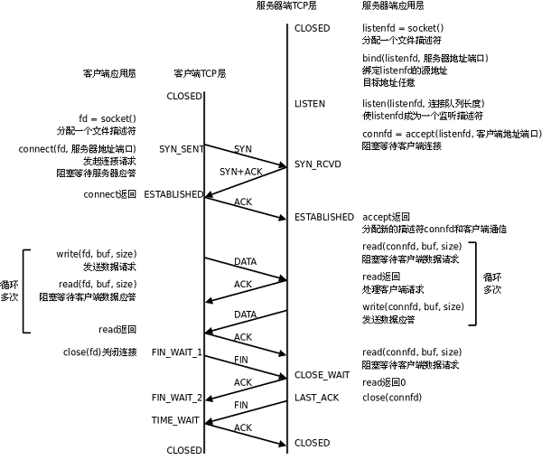

## C/S模型-TCP

下图是基于TCP协议的客户端/服务器程序的一般流程：

​                                

TCP协议通讯流程

服务器调用socket()、bind()、listen()完成初始化后，调用accept()阻塞等待，处于监听端口的状态，客户端调用socket()初始化后，调用connect()发出SYN段并阻塞等待服务器应答，服务器应答一个SYN-ACK段，客户端收到后从connect()返回，同时应答一个ACK段，服务器收到后从accept()返回。

数据传输的过程：

建立连接后，TCP协议提供全双工的通信服务，但是一般的客户端/服务器程序的流程是由客户端主动发起请求，服务器被动处理请求，一问一答的方式。因此，服务器从accept()返回后立刻调用read()，读socket就像读管道一样，如果没有数据到达就阻塞等待，这时客户端调用write()发送请求给服务器，服务器收到后从read()返回，对客户端的请求进行处理，在此期间客户端调用read()阻塞等待服务器的应答，服务器调用write()将处理结果发回给客户端，再次调用read()阻塞等待下一条请求，客户端收到后从read()返回，发送下一条请求，如此循环下去。

如果客户端没有更多的请求了，就调用close()关闭连接，就像写端关闭的管道一样，服务器的read()返回0，这样服务器就知道客户端关闭了连接，也调用close()关闭连接。注意，任何一方调用close()后，连接的两个传输方向都关闭，不能再发送数据了。如果一方调用shutdown()则连接处于半关闭状态，仍可接收对方发来的数据。

在学习socket API时要注意应用程序和TCP协议层是如何交互的： 应用程序调用某个socket函数时TCP协议层完成什么动作，比如调用connect()会发出SYN段 应用程序如何知道TCP协议层的状态变化，比如从某个阻塞的socket函数返回就表明TCP协议收到了某些段，再比如read()返回0就表明收到了FIN段

### server

下面通过最简单的客户端/服务器程序的实例来学习socket API。

server.c的作用是从客户端读字符，然后将每个字符转换为大写并回送给客户端。

```c++
#include <stdio.h>
#include <stdlib.h>
#include <string.h>
#include <unistd.h>
#include <sys/socket.h>
#include <netinet/in.h>
#include <arpa/inet.h>

#define MAXLINE 80
#define SERV_PORT 6666

 

int main(void){
  struct sockaddr_in servaddr, cliaddr;
  socklen_t cliaddr_len;
  int listenfd, connfd;
  char buf[MAXLINE];
  char str[INET_ADDRSTRLEN];
  int i, n;
 
  listenfd = socket(AF_INET, SOCK_STREAM, 0);
    
  bzero(&servaddr, sizeof(servaddr));
  servaddr.sin_family = AF_INET;
  servaddr.sin_addr.s_addr = htonl(INADDR_ANY);
  servaddr.sin_port = htons(SERV_PORT);
    
  bind(listenfd, (struct sockaddr *)&servaddr, sizeof(servaddr));
  listen(listenfd, 20);
  printf("Accepting connections ...\n");
    
  while (1) {
    cliaddr_len = sizeof(cliaddr);
    connfd = accept(listenfd, (struct sockaddr *)&cliaddr, &cliaddr_len);
    n = read(connfd, buf, MAXLINE);
    printf("received from %s at PORT %d\n",
    inet_ntop(AF_INET, &cliaddr.sin_addr, str, sizeof(str)),
    ntohs(cliaddr.sin_port));
    for (i = 0; i < n; i++)
      buf[i] = toupper(buf[i]);
    write(connfd, buf, n);
    close(connfd);
  }
  return 0;
}
```


### client

client.c的作用是从命令行参数中获得一个字符串发给服务器，然后接收服务器返回的字符串并打印。

```c++
#include <stdio.h>
#include <stdlib.h>
#include <string.h>
#include <unistd.h>
#include <sys/socket.h>
#include <netinet/in.h>

#define MAXLINE 80
#define SERV_PORT 6666

int main(int argc, char *argv[]){
  	struct sockaddr_in servaddr;
  	char buf[MAXLINE];
  	int sockfd, n;
	char *str;
    
  	if (argc != 2) {
    	fputs("usage: ./client message\n", stderr);
    	exit(1);
  	}
    
    str = argv[1];
      sockfd = socket(AF_INET, SOCK_STREAM, 0);
    
      bzero(&servaddr, sizeof(servaddr));
      servaddr.sin_family = AF_INET;
      inet_pton(AF_INET, "127.0.0.1", &servaddr.sin_addr);
      servaddr.sin_port = htons(SERV_PORT);
    
      connect(sockfd, (struct sockaddr *)&servaddr, sizeof(servaddr));
      write(sockfd, str, strlen(str));
      n = read(sockfd, buf, MAXLINE);
      printf("Response from server:\n");
      write(STDOUT_FILENO, buf, n);
      close(sockfd);
      return 0;
}
```

由于客户端不需要固定的端口号，因此不必调用bind()，客户端的端口号由内核自动分配。

**注意，客户端不是不允许调用bind()，只是没有必要调用bind()固定一个端口号**，**服务器也不是必须调用bind()，**但如果服务器不调用bind()，内核会自动给服务器分配监听端口，每次启动服务器时端口号都不一样，客户端要连接服务器就会遇到麻烦。

客户端和服务器启动后可以使用netstat命令查看链接情况：

```c++
netstat -apn|grep 6666
```

