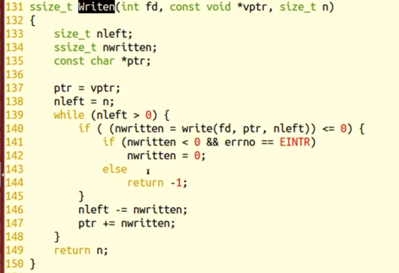

## 出错处理封装函数

上面的例子不仅功能简单，而且简单到几乎没有什么错误处理，我们知道，系统调用不能保证每次都成功，必须进行出错处理，这样一方面可以保证程序逻辑正常，另一方面可以迅速得到故障信息。

为使错误处理的代码不影响主程序的可读性，我们把与socket相关的一些系统函数加上错误处理代码包装成新的函数，做成一个模块wrap.c：


### wrap.h

```c++
#ifndef __WRAP_H_
#define __WRAP_H_

void perr_exit(const char *s);
int Accept(int fd, struct sockaddr *sa, socklen_t *salenptr);
int Bind(int fd, const struct sockaddr *sa, socklen_t salen);
int Connect(int fd, const struct sockaddr *sa, socklen_t salen);
int Listen(int fd, int backlog);
int Socket(int family, int type, int protocol);
ssize_t Read(int fd, void *ptr, size_t nbytes);
ssize_t Write(int fd, const void *ptr, size_t nbytes);
int Close(int fd);
ssize_t Readn(int fd, void *vptr, size_t n);
ssize_t Writen(int fd, const void *vptr, size_t n);
ssize_t my_read(int fd, char *ptr);
ssize_t Readline(int fd, void *vptr, size_t maxlen);

#endif
```


### wrap.c

```c++
#include <stdlib.h>
#include <errno.h>
#include <sys/socket.h>

void perr_exit(const char *s){
  perror(s);
  exit(1);
}

int Accept(int fd, struct sockaddr *sa, socklen_t *salenptr){
  int n;
  again:
  if ( (n = accept(fd, sa, salenptr)) < 0) {
    if ((errno == ECONNABORTED) || (errno == EINTR))
     	goto again;
    else
      	perr_exit("accept error");
  }
  return n;
}

int Bind(int fd, const struct sockaddr *sa, socklen_t salen){
  int n;
  if ((n = bind(fd, sa, salen)) < 0)
    perr_exit("bind error");
  return n;
}

int Connect(int fd, const struct sockaddr *sa, socklen_t salen){
  int n;
  if ((n = connect(fd, sa, salen)) < 0)
    perr_exit("connect error");
  return n;
}

int Listen(int fd, int backlog){
 int n;
  if ((n = listen(fd, backlog)) < 0)
    perr_exit("listen error");
  return n;
}

int Socket(int family, int type, int protocol){
  int n;
  if ( (n = socket(family, type, protocol)) < 0)
    perr_exit("socket error");
  return n;
}

ssize_t Read(int fd, void *ptr, size_t nbytes){
  ssize_t n;
again:
  if ( (n = read(fd, ptr, nbytes)) == -1) {
    if (errno == EINTR)
      goto again;
    else
      return -1;
  }
  return n;
}

ssize_t Write(int fd, const void *ptr, size_t nbytes){
  ssize_t n;
again:
  if ( (n = write(fd, ptr, nbytes)) == -1) {
    if (errno == EINTR)
      goto again;
    else
      return -1;
  }
  return n;
}

int Close(int fd){
  int n;
  if ((n = close(fd)) == -1)
    perr_exit("close error");
  return n;
}

ssize_t Readn(int fd, void *vptr, size_t n){
  size_t nleft;
  ssize_t nread;
  char *ptr;
  ptr = vptr;
  nleft = n;
  while (nleft > 0) {
    if ( (nread = read(fd, ptr, nleft)) < 0) {
      if (errno == EINTR)
        nread = 0;
      else
        return -1;
    } else if (nread == 0)
      break;
    nleft -= nread;
    ptr += nread;
  }
  return n - nleft;
}

 

ssize_t Writen(int fd, const void *vptr, size_t n){
  size_t nleft;
  ssize_t nwritten;
  const char *ptr;
  ptr = vptr;
  nleft = n;
  while (nleft > 0) {
    if ( (nwritten = write(fd, ptr, nleft)) <= 0) {
      if (nwritten < 0 && errno == EINTR)
        nwritten = 0;
      else
        return -1;
    }
    nleft -= nwritten;
    ptr += nwritten;
  }
  return n;
}

 

static ssize_t my_read(int fd, char *ptr){
  static int read_cnt;
  static char *read_ptr;
  static char read_buf[100];
  if (read_cnt <= 0) {
again:
    if ((read_cnt = read(fd, read_buf, sizeof(read_buf))) < 0) {
      if (errno == EINTR)
        goto again;
      return -1; 
    } else if (read_cnt == 0)
      return 0;
    read_ptr = read_buf;
  }
  read_cnt--;
  *ptr = *read_ptr++;
  return 1;
}

 

ssize_t Readline(int fd, void *vptr, size_t maxlen){
  ssize_t n, rc;
  char c, *ptr;
  ptr = vptr;
  for (n = 1; n < maxlen; n++) {
    if ( (rc = my_read(fd, &c)) == 1) {
      *ptr++ = c;
      if (c == '\n')
       break;
    } else if (rc == 0) {
      *ptr = 0;
      return n - 1;
   } else
      return -1;
  }
  *ptr = 0;
  return n;
}
```


#### readn封装


#### writen封装

