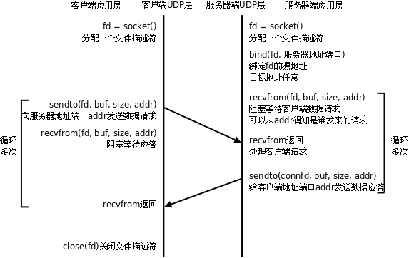
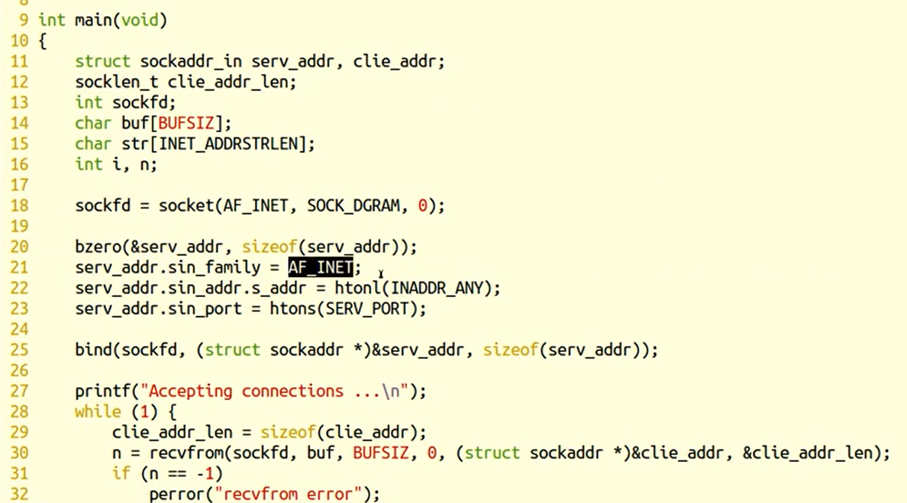
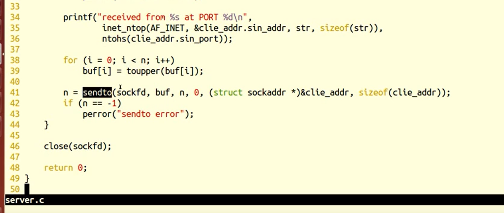
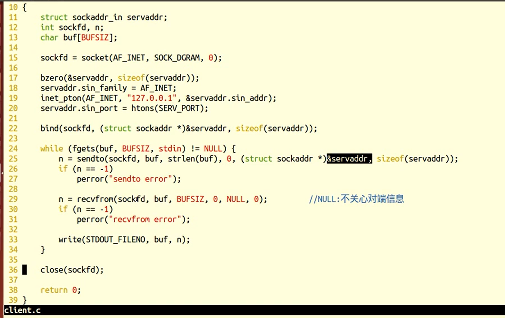

> ## UDP服务器
>
> 传输层主要应用的协议模型有两种，一种是TCP协议，另外一种则是UDP协议。TCP协议在网络通信中占主导地位，绝大多数的网络通信借助TCP协议完成数据传输。但UDP也是网络通信中不可或缺的重要通信手段。
>
> 相较于TCP而言，UDP通信的形式更像是发短信。不需要在数据传输之前建立、维护连接。只专心获取数据就好。省去了三次握手的过程，通信速度可以大大提高，但与之伴随的通信的稳定性和正确率便得不到保证。因此，我们称UDP为“无连接的不可靠报文传递”。
>
> 那么与我们熟知的TCP相比，UDP有哪些优点和不足呢？由于无需创建连接，所以UDP开销较小，数据传输速度快，实时性较强。多用于对实时性要求较高的通信场合，如视频会议、电话会议等。但随之也伴随着数据传输不可靠，传输数据的正确率、传输顺序和流量都得不到控制和保证。所以，通常情况下，使用UDP协议进行数据传输，为保证数据的正确性，我们需要在应用层添加辅助校验协议来弥补UDP的不足，以达到数据可靠传输的目的。
>
> 与TCP类似的，UDP也有可能出现缓冲区被填满后，再接收数据时丢包的现象。由于它没有TCP滑动窗口的机制，通常采用如下两种方法解决：
>
> 1)     服务器应用层设计流量控制，控制发送数据速度。
>
> 2)     借助setsockopt函数改变接收缓冲区大小。如：
>
> ```c++
> \#include <sys/socket.h>
> 
> int setsockopt(int sockfd, int level, int optname, const void *optval, socklen_t optlen);
> 
>   int n = 220x1024
> 
>   setsockopt(sockfd, SOL_SOCKET, SO_RCVBUF, &n, sizeof(n));
> ```
>
> 


## C/S模型-UDP

​                                


由于UDP不需要维护连接，程序逻辑简单了很多，但是UDP协议是不可靠的，保证通讯可靠性的机制需要在应用层实现。

编译运行server，在两个终端里各开一个client与server交互，看看server是否具有并发服务的能力。用Ctrl+C关闭server，然后再运行server，看此时client还能否和server联系上。和前面TCP程序的运行结果相比较，体会无连接的含义。

### recvfrom

```c
ssize_t recvfrom(int sockfd, void *buf, size_t len, int flags,struct sockaddr *src_addr, socklen_t *addrlen);

返回值： 
    成功接收数据字节数。 失败：-1 errn。 0： 对端关闭。
参数：
    sockfd： 套接字
    buf：缓冲区地址
    len：缓冲区大小
    flags： 0
    src_addr：（struct sockaddr *）&addr 传出。 对端地址结构
    addrlen：传入传出。				
```

#### sendto

```c++
ssize_t sendto(int sockfd, const void *buf, size_t len, int flags,const struct sockaddr *dest_addr, socklen_t addrlen);

返回值：
    成功写出数据字节数。 失败 -1， errno	
参数：    
    sockfd： 套接字
    buf：存储数据的缓冲区
    len：数据长度
    flags： 0
    src_addr：（struct sockaddr *）&addr 传入。 目标地址结构
    addrlen：地址结构长度。

```


### server






### client




### server

```c
#include <string.h>
#include <stdio.h>
#include <unistd.h>
#include <arpa/inet.h>
#include <ctype.h>

#define SERV_PORT 8000

int main(void)
{
    struct sockaddr_in serv_addr, clie_addr;
    socklen_t clie_addr_len;
    int sockfd;
    char buf[BUFSIZ];
    char str[INET_ADDRSTRLEN];
    int i, n;

    sockfd = socket(AF_INET, SOCK_DGRAM, 0);

    bzero(&serv_addr, sizeof(serv_addr));
    serv_addr.sin_family = AF_INET;
    serv_addr.sin_addr.s_addr = htonl(INADDR_ANY);
    serv_addr.sin_port = htons(SERV_PORT);

    bind(sockfd, (struct sockaddr *)&serv_addr, sizeof(serv_addr));

    printf("Accepting connections ...\n");
    while (1) {
        clie_addr_len = sizeof(clie_addr);
        n = recvfrom(sockfd, buf, BUFSIZ,0, (struct sockaddr *)&clie_addr, &clie_addr_len);
        if (n == -1)
            perror("recvfrom error");

        printf("received from %s at PORT %d\n",
                inet_ntop(AF_INET, &clie_addr.sin_addr, str, sizeof(str)),
                ntohs(clie_addr.sin_port));

        for (i = 0; i < n; i++)
            buf[i] = toupper(buf[i]);

        n = sendto(sockfd, buf, n, 0, (struct sockaddr *)&clie_addr, sizeof(clie_addr));
        if (n == -1)
            perror("sendto error");
    }

    close(sockfd);

    return 0;
}


```


```
#include <string.h>

\#include <netinet/in.h>

\#include <stdio.h>

\#include <unistd.h>

\#include <strings.h>

\#include <arpa/inet.h>

\#include <ctype.h>

 

\#define MAXLINE 80

\#define SERV_PORT 6666

 

int main(void)

{

  struct sockaddr_in servaddr, cliaddr;

  socklen_t cliaddr_len;

  int sockfd;

  char buf[MAXLINE];

  char str[INET_ADDRSTRLEN];

  int i, n;

 

  sockfd = socket(AF_INET, SOCK_DGRAM, 0);

 

  bzero(&servaddr, sizeof(servaddr));

  servaddr.sin_family = AF_INET;

  servaddr.sin_addr.s_addr = htonl(INADDR_ANY);

  servaddr.sin_port = htons(SERV_PORT);

 

  bind(sockfd, (struct sockaddr *)&servaddr, sizeof(servaddr));

  printf("Accepting connections ...\n");

 

  while (1) {

​    cliaddr_len = sizeof(cliaddr);

​    n = recvfrom(sockfd, buf, MAXLINE,0, (struct sockaddr *)&cliaddr, &cliaddr_len);

​    if (n == -1)

​      perror("recvfrom error");

​    printf("received from %s at PORT %d\n", 

​        inet_ntop(AF_INET, &cliaddr.sin_addr, str, sizeof(str)),

​        ntohs(cliaddr.sin_port));

​    for (i = 0; i < n; i++)

​      buf[i] = toupper(buf[i]);

 

​    n = sendto(sockfd, buf, n, 0, (struct sockaddr *)&cliaddr, sizeof(cliaddr));

​    if (n == -1)

​      perror("sendto error");

  }

  close(sockfd);

  return 0;

}
```


### client

```c
#include <stdio.h>
#include <string.h>
#include <unistd.h>
#include <arpa/inet.h>
#include <ctype.h>

#define SERV_PORT 8000

int main(int argc, char *argv[])
{
    struct sockaddr_in servaddr;
    int sockfd, n;
    char buf[BUFSIZ];

    sockfd = socket(AF_INET, SOCK_DGRAM, 0);

    bzero(&servaddr, sizeof(servaddr));
    servaddr.sin_family = AF_INET;
    inet_pton(AF_INET, "127.0.0.1", &servaddr.sin_addr);
    servaddr.sin_port = htons(SERV_PORT);

    bind(sockfd, (struct sockaddr *)&servaddr, sizeof(servaddr));

    while (fgets(buf, BUFSIZ, stdin) != NULL) {
        n = sendto(sockfd, buf, strlen(buf), 0, (struct sockaddr *)&servaddr, sizeof(servaddr));
        if (n == -1)
            perror("sendto error");

        n = recvfrom(sockfd, buf, BUFSIZ, 0, NULL, 0);         //NULL:不关心对端信息
        if (n == -1)
            perror("recvfrom error");

        write(STDOUT_FILENO, buf, n);
    }

    close(sockfd);

    return 0;
}
```


```
#include <stdio.h>

\#include <string.h>

\#include <unistd.h>

\#include <netinet/in.h>

\#include <arpa/inet.h>

\#include <strings.h>

\#include <ctype.h>

 

\#define MAXLINE 80

\#define SERV_PORT 6666

 

int main(int argc, char *argv[])

{

  struct sockaddr_in servaddr;

  int sockfd, n;

  char buf[MAXLINE];

 

  sockfd = socket(AF_INET, SOCK_DGRAM, 0);

 

  bzero(&servaddr, sizeof(servaddr));

  servaddr.sin_family = AF_INET;

  inet_pton(AF_INET, "127.0.0.1", &servaddr.sin_addr);

  servaddr.sin_port = htons(SERV_PORT);

 

  while (fgets(buf, MAXLINE, stdin) != NULL) {

​    n = sendto(sockfd, buf, strlen(buf), 0, (struct sockaddr *)&servaddr, sizeof(servaddr));

​    if (n == -1)

​      perror("sendto error");

​    n = recvfrom(sockfd, buf, MAXLINE, 0, NULL, 0);

​    if (n == -1)

​      perror("recvfrom error");

​    write(STDOUT_FILENO, buf, n);

  }

  close(sockfd);

  return 0;

}
```

