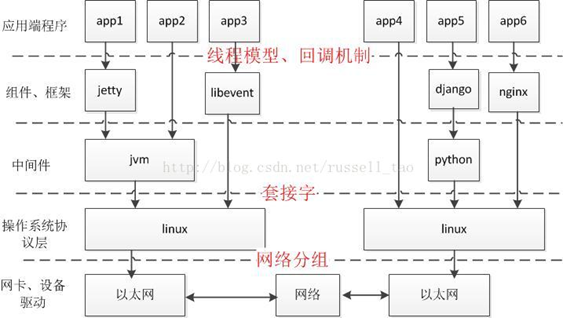

## 多进程并发服务器



使用多进程并发服务器时要考虑以下几点：

1. 父进程最大文件描述个数(父进程中需要close关闭accept返回的新文件描述符)

2. 系统内创建进程个数(与内存大小相关)

3. 进程创建过多是否降低整体服务性能(进程调度)

### server

```c++
/* server.c */

#include <stdio.h>
#include <string.h>
#include <netinet/in.h>
#include <arpa/inet.h>
#include <signal.h>
#include <sys/wait.h>
#include <sys/types.h>
#include "wrap.h"

#define MAXLINE 80
#define SERV_PORT 800

void do_sigchild(int num){
  while (waitpid(0, NULL, WNOHANG) > 0);
}

int main(void){
  struct sockaddr_in servaddr, cliaddr;
  socklen_t cliaddr_len;
  int listenfd, connfd;
  char buf[MAXLINE];
  char str[INET_ADDRSTRLEN];
  int i, n;
  pid_t pid;

  struct sigaction newact;
  newact.sa_handler = do_sigchild;
  sigemptyset(&newact.sa_mask);
  newact.sa_flags = 0;
  sigaction(SIGCHLD, &newact, NULL);

  listenfd = Socket(AF_INET, SOCK_STREAM, 0);

  bzero(&servaddr, sizeof(servaddr));
  servaddr.sin_family = AF_INET;
  servaddr.sin_addr.s_addr = htonl(INADDR_ANY);
  servaddr.sin_port = htons(SERV_PORT);

  Bind(listenfd, (struct sockaddr *)&servaddr, sizeof(servaddr));

  Listen(listenfd, 20);

  printf("Accepting connections ...\n");

  while (1) {
    cliaddr_len = sizeof(cliaddr);
    connfd = Accept(listenfd, (struct sockaddr *)&cliaddr, &cliaddr_len);

    pid = fork();
    if (pid == 0) {
     Close(listenfd);
     while (1) {
            n = Read(connfd, buf, MAXLINE);
            if (n == 0) {
             printf("the other side has been closed.\n");
              break;
            }
            printf("received from %s at PORT %d\n",
               inet_ntop(AF_INET, &cliaddr.sin_addr, str, sizeof(str)),
               ntohs(cliaddr.sin_port));

           for (i = 0; i < n; i++)
              buf[i] = toupper(buf[i]);
            Write(connfd, buf, n);
          }
          Close(connfd);
        return 0;
    } else if (pid > 0) {
     Close(connfd);
    } else
      perr_exit("fork");
  }
  Close(listenfd);
  return 0;
}
```


### client

```c++
/* client.c */

#include <stdio.h>
#include <string.h>
#include <unistd.h>
#include <netinet/in.h>
#include "wrap.h"

#define MAXLINE 80
#define SERV_PORT 6666

int main(int argc, char *argv[]){
  struct sockaddr_in servaddr;
  char buf[MAXLINE];
  int sockfd, n;

  sockfd = Socket(AF_INET, SOCK_STREAM, 0);
  
  bzero(&servaddr, sizeof(servaddr));
  servaddr.sin_family = AF_INET;
  inet_pton(AF_INET, "127.0.0.1", &servaddr.sin_addr);
  servaddr.sin_port = htons(SERV_PORT);
  Connect(sockfd, (struct sockaddr *)&servaddr, sizeof(servaddr));
  
  while (fgets(buf, MAXLINE, stdin) != NULL) {
    Write(sockfd, buf, strlen(buf));
    n = Read(sockfd, buf, MAXLINE);
    if (n == 0) {
      printf("the other side has been closed.\n");
     break;
    } else
     Write(STDOUT_FILENO, buf, n);
  }

  Close(sockfd);
  return 0;
}
```

 

