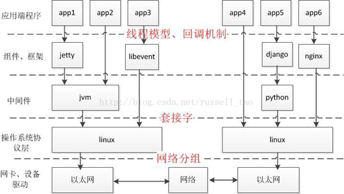

## 多线程并发服务器

在使用线程模型开发服务器时需考虑以下问题：

1. 调整进程内最大文件描述符上限

2. 线程如有共享数据，考虑线程同步

3. 服务于客户端线程退出时，退出处理。（退出值，分离态）

4. 系统负载，随着链接客户端增加，导致其它线程不能及时得到CPU

### server

```c++
/* server.c */
#include <stdio.h>
#include <string.h>
#include <netinet/in.h>
#include <arpa/inet.h>
#include <pthread.h>
#include "wrap.h"

#define MAXLINE 80
#define SERV_PORT 6666

 
struct s_info {
  struct sockaddr_in cliaddr;
  int connfd;
};

void *do_work(void *arg){
  int n,i;
  struct s_info *ts = (struct s_info*)arg;
  char buf[MAXLINE];
  char str[INET_ADDRSTRLEN];
  /* 可以在创建线程前设置线程创建属性,设为分离态,哪种效率高内？ */

  pthread_detach(pthread_self());
  while (1) {
    n = Read(ts->connfd, buf, MAXLINE);
    if (n == 0) {
      printf("the other side has been closed.\n");
      break;
    }
    printf("received from %s at PORT %d\n",
       inet_ntop(AF_INET, &(*ts).cliaddr.sin_addr, str, sizeof(str)),
        ntohs((*ts).cliaddr.sin_port));
    for (i = 0; i < n; i++)
      buf[i] = toupper(buf[i]);
    Write(ts->connfd, buf, n);
  }
  Close(ts->connfd);
}

int main(void){
  struct sockaddr_in servaddr, cliaddr;
  socklen_t cliaddr_len;
  int listenfd, connfd;
  int i = 0;
  pthread_t tid;
  struct s_info ts[256];
    //创建监听socket
  listenfd = Socket(AF_INET, SOCK_STREAM, 0);
    //初始化服务器地址
  bzero(&servaddr, sizeof(servaddr));
  servaddr.sin_family = AF_INET;
  servaddr.sin_addr.s_addr = htonl(INADDR_ANY);
  servaddr.sin_port = htons(SERV_PORT);
    //绑定监听socket与服务器地址
  Bind(listenfd, (struct sockaddr *)&servaddr, sizeof(servaddr));
    //设置半连接的最大数量
  Listen(listenfd, 20);

  printf("Accepting connections ...\n");

  while (1) {
    cliaddr_len = sizeof(cliaddr);
      
    connfd = Accept(listenfd, (struct sockaddr *)&cliaddr, &cliaddr_len);
      
    ts[i].cliaddr = cliaddr;
   ts[i].connfd = connfd;
    /* 达到线程最大数时，pthread_create出错处理, 增加服务器稳定性 */
   pthread_create(&tid, NULL, do_work, (void*)&ts[i]);
    i++;
  }
  return 0;
}
```


### client

```c++
/* client.c */

#include <stdio.h>
#include <string.h>
#include <unistd.h>
#include <netinet/in.h>
#include "wrap.h"

#define MAXLINE 80
#define SERV_PORT 6666

int main(int argc, char *argv[]){
  struct sockaddr_in servaddr;
  char buf[MAXLINE];
  int sockfd, n;

  sockfd = Socket(AF_INET, SOCK_STREAM, 0);

  bzero(&servaddr, sizeof(servaddr));
  servaddr.sin_family = AF_INET;
  inet_pton(AF_INET, "127.0.0.1", &servaddr.sin_addr);
  servaddr.sin_port = htons(SERV_PORT);
  Connect(sockfd, (struct sockaddr *)&servaddr, sizeof(servaddr));

  while (fgets(buf, MAXLINE, stdin) != NULL) {
    Write(sockfd, buf, strlen(buf));
    n = Read(sockfd, buf, MAXLINE);
    if (n == 0)
      printf("the other side has been closed.\n");
    else
      Write(STDOUT_FILENO, buf, n);
  }
  Close(sockfd);
  return 0;
}
```

