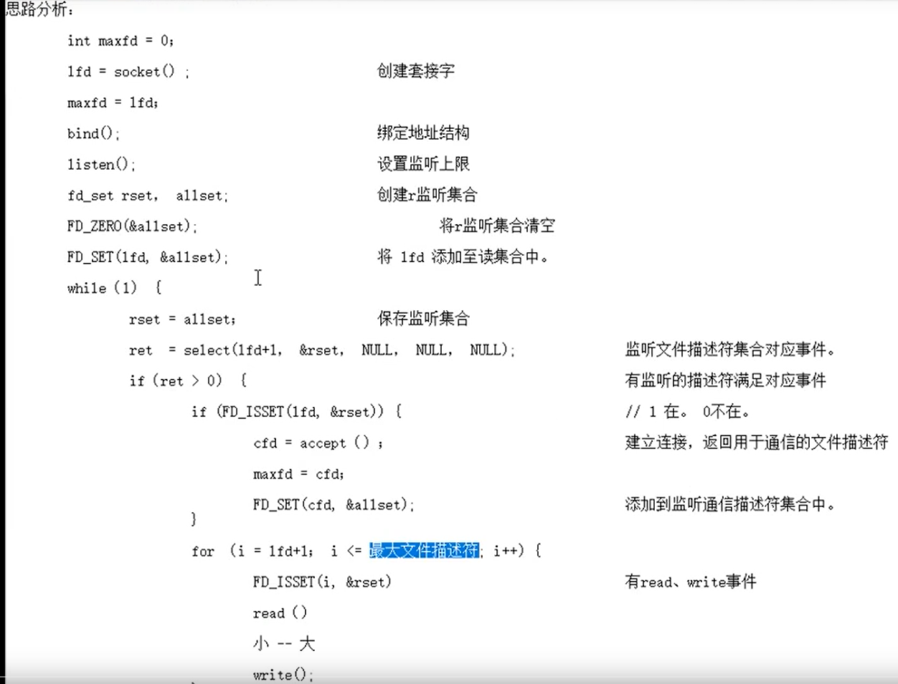
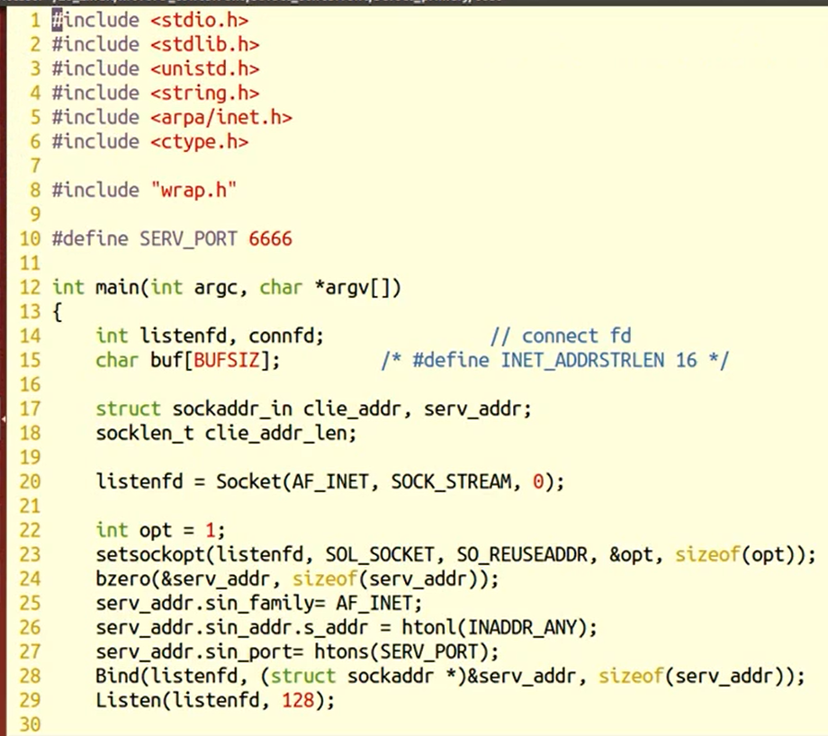
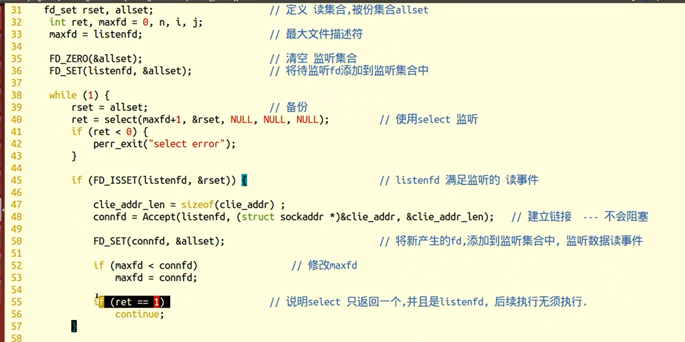
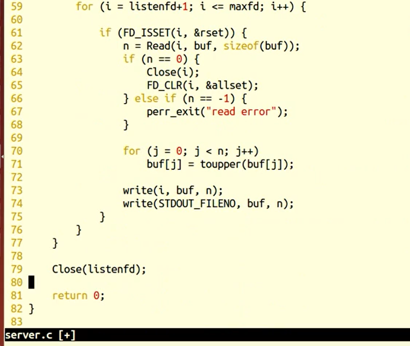
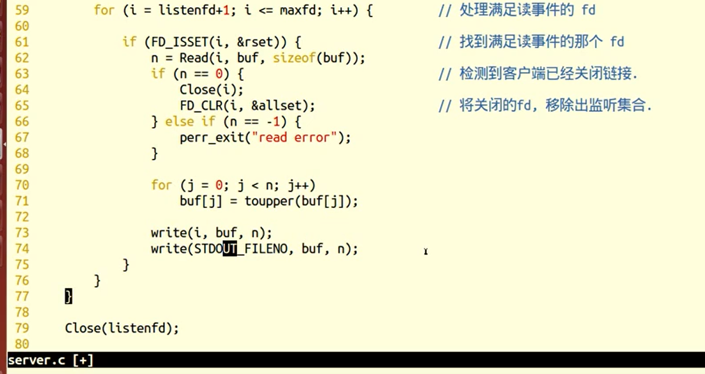
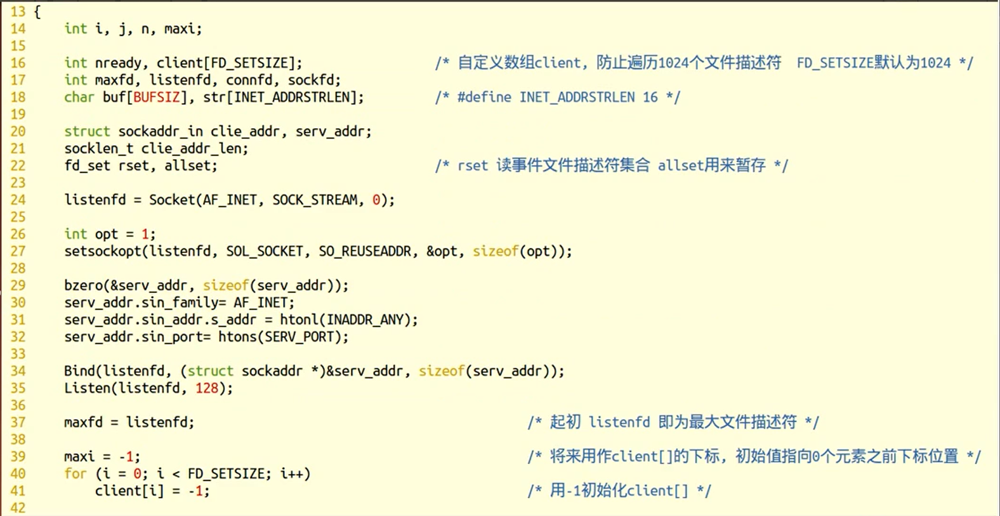
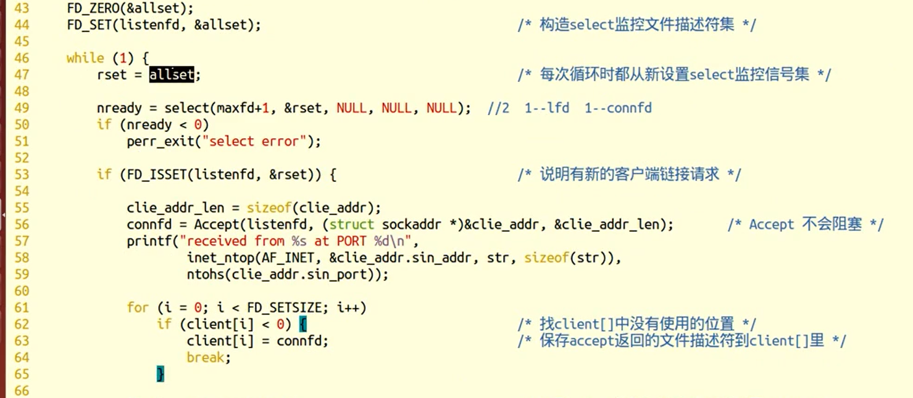
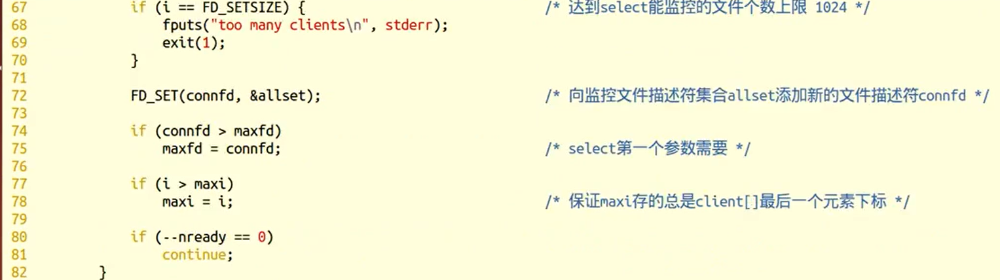
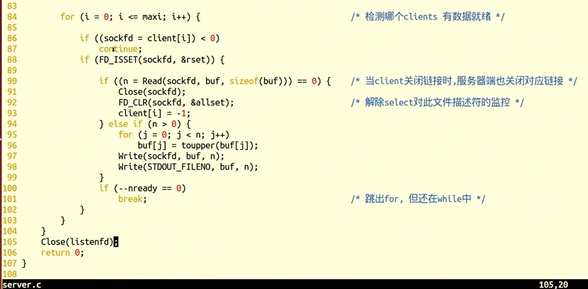

### select

1. select能监听的文件描述符个数受限于FD_SETSIZE,一般为1024，单纯改变进程打开的文件描述符个数并不能改变select监听文件个数

2. 解决1024以下客户端时使用select是很合适的，但如果链接客户端过多，select采用的是轮询模型，会大大降低服务器响应效率，不应在select上投入更多精力

```c++
#include <sys/select.h>

/* According to earlier standards */
#include <sys/time.h>
#include <sys/types.h>
#include <unistd.h>

int select(int nfds, fd_set *readfds, fd_set *writefds,
fd_set *exceptfds, struct timeval *timeout);

  nfds:   	监控的文件描述符集里最大文件描述符加1，因为此参数会告诉内核检测前多少个文件描述符的状态
  readfds： 	监控有读数据到达文件描述符集合，传入传出参数
  writefds： 监控写数据到达文件描述符集合，传入传出参数
  exceptfds：监控异常发生达文件描述符集合,如带外数据到达异常，传入传出参数
  timeout：  定时阻塞监控时间，3种情况
        1.NULL，永远等下去
        2.设置timeval，等待固定时间
        3.设置timeval里时间均为0，检查描述字后立即返回，轮询
  struct timeval {
    long tv_sec; /* seconds */
    long tv_usec; /* microseconds */
  };

  void FD_CLR(int fd, fd_set *set);  //把文件描述符集合里fd清0
  int FD_ISSET(int fd, fd_set *set);  //测试文件描述符集合里fd是否置1
  void FD_SET(int fd, fd_set *set);  //把文件描述符集合里fd位置1
  void FD_ZERO(fd_set *set);     //把文件描述符集合里所有位清0
```




### selectServer_primer










#### selectServer_array










#### server

```
/* server.c */

#include <stdio.h>
#include <stdlib.h>
#include <string.h>
#include <netinet/in.h>
#include <arpa/inet.h>
#include "wrap.h"

 

#define MAXLINE 80
#define SERV_PORT 6666

 

int main(int argc, char *argv[]){
 
  int i, maxi, maxfd, listenfd, connfd, sockfd;
  int nready, client[FD_SETSIZE];   /* FD_SETSIZE 默认为 1024 */
  ssize_t n;
  fd_set rset, allset;
  char buf[MAXLINE];

  char str[INET_ADDRSTRLEN];     /* #define INET_ADDRSTRLEN 16 */

  socklen_t cliaddr_len;

  struct sockaddr_in cliaddr, servaddr;

 

  listenfd = Socket(AF_INET, SOCK_STREAM, 0);

 

bzero(&servaddr, sizeof(servaddr));

servaddr.sin_family = AF_INET;

servaddr.sin_addr.s_addr = htonl(INADDR_ANY);

servaddr.sin_port = htons(SERV_PORT);

 

Bind(listenfd, (struct sockaddr *)&servaddr, sizeof(servaddr));

 

Listen(listenfd, 20);    /* 默认最大128 */

 

maxfd = listenfd;      /* 初始化 */

maxi = -1;         /* client[]的下标 */

 

for (i = 0; i < FD_SETSIZE; i++)

  client[i] = -1;     /* 用-1初始化client[] */

 

FD_ZERO(&allset);

FD_SET(listenfd, &allset); /* 构造select监控文件描述符集 */

 

for ( ; ; ) {

  rset = allset;      /* 每次循环时都从新设置select监控信号集 */

  nready = select(maxfd+1, &rset, NULL, NULL, NULL);

 

  if (nready < 0)

​    perr_exit("select error");

  if (FD_ISSET(listenfd, &rset)) { /* new client connection */

​    cliaddr_len = sizeof(cliaddr);

​    connfd = Accept(listenfd, (struct sockaddr *)&cliaddr, &cliaddr_len);

​    printf("received from %s at PORT %d\n",

​        inet_ntop(AF_INET, &cliaddr.sin_addr, str, sizeof(str)),

​        ntohs(cliaddr.sin_port));

​    for (i = 0; i < FD_SETSIZE; i++) {

​      if (client[i] < 0) {

​        client[i] = connfd; /* 保存accept返回的文件描述符到client[]里 */

​        break;

​      }

​    }

​    /* 达到select能监控的文件个数上限 1024 */

​    if (i == FD_SETSIZE) {

​      fputs("too many clients\n", stderr);

​      exit(1);

​    }

 

​    FD_SET(connfd, &allset);  /* 添加一个新的文件描述符到监控信号集里 */

​    if (connfd > maxfd)

​      maxfd = connfd;     /* select第一个参数需要 */

​    if (i > maxi)

​      maxi = i;        /* 更新client[]最大下标值 */

 

​    if (--nready == 0)

​      continue;        /* 如果没有更多的就绪文件描述符继续回到上面select阻塞监听,

​                    负责处理未处理完的就绪文件描述符 */

​    }

​    for (i = 0; i <= maxi; i++) {  /* 检测哪个clients 有数据就绪 */

​      if ( (sockfd = client[i]) < 0)

​        continue;

​      if (FD_ISSET(sockfd, &rset)) {

​        if ( (n = Read(sockfd, buf, MAXLINE)) == 0) {

​          Close(sockfd);   /* 当client关闭链接时，服务器端也关闭对应链接 */

​          FD_CLR(sockfd, &allset); /* 解除select监控此文件描述符 */

​          client[i] = -1;

​        } else {

​          int j;

​          for (j = 0; j < n; j++)

​            buf[j] = toupper(buf[j]);

​          Write(sockfd, buf, n);

​        }

​        if (--nready == 0)

​          break;

​      }

​    }

  }

  close(listenfd);

  return 0;

}
```


#### client

```
/* client.c */

\#include <stdio.h>

\#include <string.h>

\#include <unistd.h>

\#include <netinet/in.h>

\#include "wrap.h"

 

\#define MAXLINE 80

\#define SERV_PORT 6666

 

int main(int argc, char *argv[])

{

  struct sockaddr_in servaddr;

  char buf[MAXLINE];

  int sockfd, n;

 

  sockfd = Socket(AF_INET, SOCK_STREAM, 0);

 

  bzero(&servaddr, sizeof(servaddr));

  servaddr.sin_family = AF_INET;

  inet_pton(AF_INET, "127.0.0.1", &servaddr.sin_addr);

  servaddr.sin_port = htons(SERV_PORT);

 

  Connect(sockfd, (struct sockaddr *)&servaddr, sizeof(servaddr));

 

  while (fgets(buf, MAXLINE, stdin) != NULL) {

​    Write(sockfd, buf, strlen(buf));

​    n = Read(sockfd, buf, MAXLINE);

​    if (n == 0)

​      printf("the other side has been closed.\n");

​    else

​      Write(STDOUT_FILENO, buf, n);

  }

  Close(sockfd);

  return 0;

}
```


#### pselect

pselect原型如下。此模型应用较少，有需要的同学可参考select模型自行编写C/S

```
#include <sys/select.h>

int pselect(int nfds, fd_set *readfds, fd_set *writefds,

​      fd_set *exceptfds, const struct timespec *timeout,

​      const sigset_t *sigmask);

  struct timespec {

​    long tv_sec; /* seconds */

​    long tv_nsec; /* nanoseconds */

  };
```

  用sigmask替代当前进程的阻塞信号集，调用返回后还原原有阻塞信号集