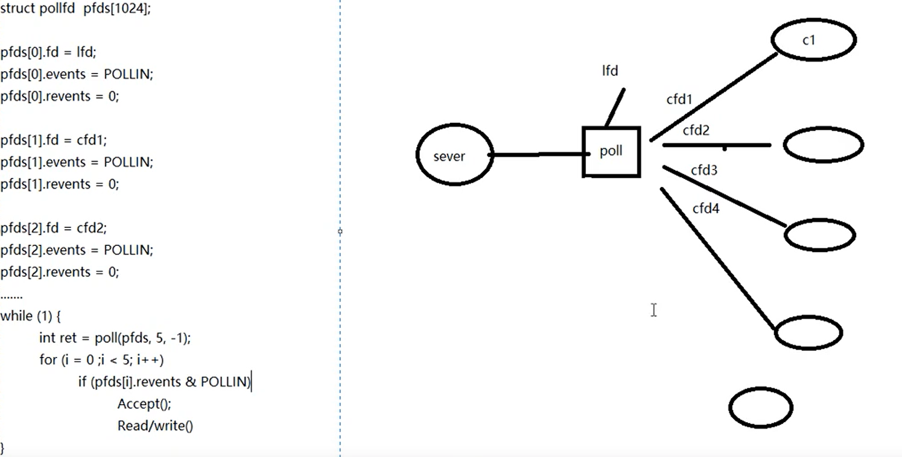
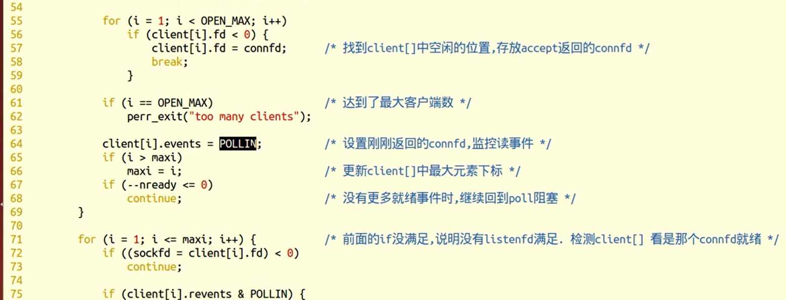
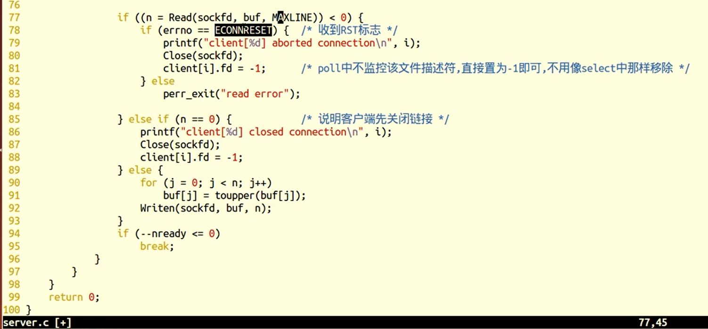

### poll函数

```c++
#include <poll.h>

int poll(struct pollfd *fds, nfds_t nfds, int timeout);

  struct pollfd {
    int fd; /* 文件描述符 */
    short events; /* 监控的事件 */
    short revents; /* 监控事件中满足条件返回的事件 */
  };

  POLLIN     普通或带外优先数据可读,即POLLRDNORM | POLLRDBAND
  POLLRDNORM   数据可读
  POLLRDBAND   优先级带数据可读
  POLLPRI     高优先级可读数据
  POLLOUT    普通或带外数据可写
  POLLWRNORM   数据可写
  POLLWRBAND   优先级带数据可写
  POLLERR     发生错误
  POLLHUP     发生挂起
  POLLNVAL     描述字不是一个打开的文件

  nfds       监控数组中有多少文件描述符需要被监控
  timeout     毫秒级等待
    -1：阻塞等，#define INFTIM -1         Linux中没有定义此宏
    0：立即返回，不阻塞进程
    >0：等待指定毫秒数，如当前系统时间精度不够毫秒，向上取值

如果不再监控某个文件描述符时，可以把pollfd中，fd设置为-1，poll不再监控此pollfd，下次返回时，把revents设置为0。
```

### pollserver







### server

```
/* server.c */

\#include <stdio.h>

\#include <stdlib.h>

\#include <string.h>

\#include <netinet/in.h>

\#include <arpa/inet.h>

\#include <poll.h>

\#include <errno.h>

\#include "wrap.h"

 

\#define MAXLINE 80

\#define SERV_PORT 6666

\#define OPEN_MAX 1024

 

int main(int argc, char *argv[])

{

  int i, j, maxi, listenfd, connfd, sockfd;

  int nready;

  ssize_t n;

  char buf[MAXLINE], str[INET_ADDRSTRLEN];

  socklen_t clilen;

  struct pollfd client[OPEN_MAX];

  struct sockaddr_in cliaddr, servaddr;

 

  listenfd = Socket(AF_INET, SOCK_STREAM, 0);

 

  bzero(&servaddr, sizeof(servaddr));

  servaddr.sin_family = AF_INET;

  servaddr.sin_addr.s_addr = htonl(INADDR_ANY);

  servaddr.sin_port = htons(SERV_PORT);

 

  Bind(listenfd, (struct sockaddr *)&servaddr, sizeof(servaddr));

 

  Listen(listenfd, 20);

 

  client[0].fd = listenfd;

  client[0].events = POLLRDNORM;         /* listenfd监听普通读事件 */

 

  for (i = 1; i < OPEN_MAX; i++)

​    client[i].fd = -1;              /* 用-1初始化client[]里剩下元素 */

  maxi = 0;                    /* client[]数组有效元素中最大元素下标 */

 

  for ( ; ; ) {

​    nready = poll(client, maxi+1, -1);     /* 阻塞 */

​    if (client[0].revents & POLLRDNORM) {    /* 有客户端链接请求 */

​      clilen = sizeof(cliaddr);

​      connfd = Accept(listenfd, (struct sockaddr *)&cliaddr, &clilen);

​      printf("received from %s at PORT %d\n",

​          inet_ntop(AF_INET, &cliaddr.sin_addr, str, sizeof(str)),

​          ntohs(cliaddr.sin_port));

​      for (i = 1; i < OPEN_MAX; i++) {

​        if (client[i].fd < 0) {

​          client[i].fd = connfd;  /* 找到client[]中空闲的位置，存放accept返回的connfd */

​          break;

​        }

​      }

 

​      if (i == OPEN_MAX)

​        perr_exit("too many clients");

 

​      client[i].events = POLLRDNORM;   /* 设置刚刚返回的connfd，监控读事件 */

​      if (i > maxi)

​        maxi = i;            /* 更新client[]中最大元素下标 */

​      if (--nready <= 0)

​        continue;            /* 没有更多就绪事件时,继续回到poll阻塞 */

​    }

​    for (i = 1; i <= maxi; i++) {      /* 检测client[] */

​      if ((sockfd = client[i].fd) < 0)

​        continue;

​      if (client[i].revents & (POLLRDNORM | POLLERR)) {

​        if ((n = Read(sockfd, buf, MAXLINE)) < 0) {

​          if (errno == ECONNRESET) { /* 当收到 RST标志时 */

​            /* connection reset by client */

​            printf("client[%d] aborted connection\n", i);

​            Close(sockfd);

​            client[i].fd = -1;

​          } else {

​            perr_exit("read error");

​          }

​        } else if (n == 0) {

​          /* connection closed by client */

​          printf("client[%d] closed connection\n", i);

​          Close(sockfd);

​          client[i].fd = -1;

​        } else {

​          for (j = 0; j < n; j++)

​            buf[j] = toupper(buf[j]);

​            Writen(sockfd, buf, n);

​        }

​        if (--nready <= 0)

​          break;       /* no more readable descriptors */

​      }

​    }

  }

  return 0;

}
```


### client

```
/* client.c */

\#include <stdio.h>

\#include <string.h>

\#include <unistd.h>

\#include <netinet/in.h>

\#include "wrap.h"

 

\#define MAXLINE 80

\#define SERV_PORT 6666

 

int main(int argc, char *argv[])

{

  struct sockaddr_in servaddr;

  char buf[MAXLINE];

  int sockfd, n;

 

  sockfd = Socket(AF_INET, SOCK_STREAM, 0);

 

  bzero(&servaddr, sizeof(servaddr));

  servaddr.sin_family = AF_INET;

  inet_pton(AF_INET, "127.0.0.1", &servaddr.sin_addr);

  servaddr.sin_port = htons(SERV_PORT);

 

  Connect(sockfd, (struct sockaddr *)&servaddr, sizeof(servaddr));

 

  while (fgets(buf, MAXLINE, stdin) != NULL) {

​    Write(sockfd, buf, strlen(buf));

​    n = Read(sockfd, buf, MAXLINE);

​    if (n == 0)

​      printf("the other side has been closed.\n");

​    else

​      Write(STDOUT_FILENO, buf, n);

  }

  Close(sockfd);

  return 0;

}
```


### ppoll

GNU定义了ppoll（非POSIX标准），可以支持设置信号屏蔽字，大家可参考poll模型自行实现C/S。

```
 

\#define _GNU_SOURCE /* See feature_test_macros(7) */

\#include <poll.h>

int ppoll(struct pollfd *fds, nfds_t nfds,

​      const struct timespec *timeout_ts, const sigset_t *sigmask);
```

