## epoll基础

epoll是Linux下多路复用IO接口select/poll的增强版本，它能显著提高程序在大量并发连接中只有少量活跃的情况下的系统CPU利用率，因为它会复用文件描述符集合来传递结果而不用迫使开发者每次等待事件之前都必须重新准备要被侦听的文件描述符集合，另一点原因就是获取事件的时候，它无须遍历整个被侦听的描述符集，只要遍历那些被内核IO事件异步唤醒而加入Ready队列的描述符集合就行了。

目前epell是linux大规模并发网络程序中的热门首选模型。

epoll除了提供select/poll那种IO事件的电平触发（Level Triggered）外，还提供了边沿触发（Edge Triggered），这就使得用户空间程序有可能缓存IO状态，减少epoll_wait/epoll_pwait的调用，提高应用程序效率。

可以使用cat命令查看一个进程可以打开的socket描述符上限。

```shell
  cat /proc/sys/fs/file-max
```

如有需要，可以通过修改配置文件的方式修改该上限值。

```powershell
  sudo vi /etc/security/limits.conf
```

  在文件尾部写入以下配置,soft软限制，hard硬限制。如下图所示。

```
  \* soft nofile 65536

  \* hard nofile 100000
```

​                                

### 基础API

#### epoll_create

​			——**创建一个epoll句柄，参数size用来告诉内核监听的文件描述符的个数，跟内存大小有关。**

```c++
 #include <sys/epoll.h>

int epoll_create(int size)   size：监听数目
```

#### epoll_ctl

​			——**控制某个epoll监控的文件描述符上的事件：注册、修改、删除。**

```c++
 #include <sys/epoll.h>
  int epoll_ctl(int epfd, int op, int fd, struct epoll_event *event)

epfd： 为epoll_creat的句柄
op：  表示动作，用3个宏来表示：
      EPOLL_CTL_ADD (注册新的fd到epfd)，
      EPOLL_CTL_MOD (修改已经注册的fd的监听事件)，
      EPOLL_CTL_DEL (从epfd删除一个fd)
fd：文件描述符
event： 告诉内核需要监听的事件
      
typedef union epoll_data {
  void *ptr;
  int fd;
  uint32_t u32;
  uint64_t u64;
} epoll_data_t;
     
struct epoll_event {
  __uint32_t events; /* Epoll events */
  epoll_data_t data; /* User data variable */
};

 EPOLLIN： 表示对应的文件描述符可以读（包括对端SOCKET正常关闭）
 EPOLLOUT： 表示对应的文件描述符可以写
 EPOLLPRI： 表示对应的文件描述符有紧急的数据可读（这里应该表示有带外数据到来）
 EPOLLERR： 表示对应的文件描述符发生错误
 EPOLLHUP： 表示对应的文件描述符被挂断；
 EPOLLET：将EPOLL设为边缘触发(Edge Triggered)模式，这是相对于水平触发(Level Triggered)而言的
 EPOLLONESHOT：只监听一次事件，当监听完这次事件之后，如果还需要继续监听这个socket的话，需要再次把这个socket加入到EPOLL队列里
  
```

#### epoll_wait

​				——**等待所监控文件描述符上有事件的产生，类似于select()调用。**

```c++
#include <sys/epoll.h>

  int epoll_wait(int epfd, struct epoll_event *events, int maxevents, int timeout)

     epfd： 为epoll_creat的句柄
	events：  用来存内核得到事件的集合，
    maxevents： 告之内核这个events有多大，这个maxevents的值不能大于创建epoll_create()时的size，
    timeout：  是超时时间
      -1： 阻塞
      0： 立即返回，非阻塞
      \>0： 指定毫秒
    返回值： 成功返回有多少文件描述符就绪，时间到时返回0，出错返回-1
```


### epollserver

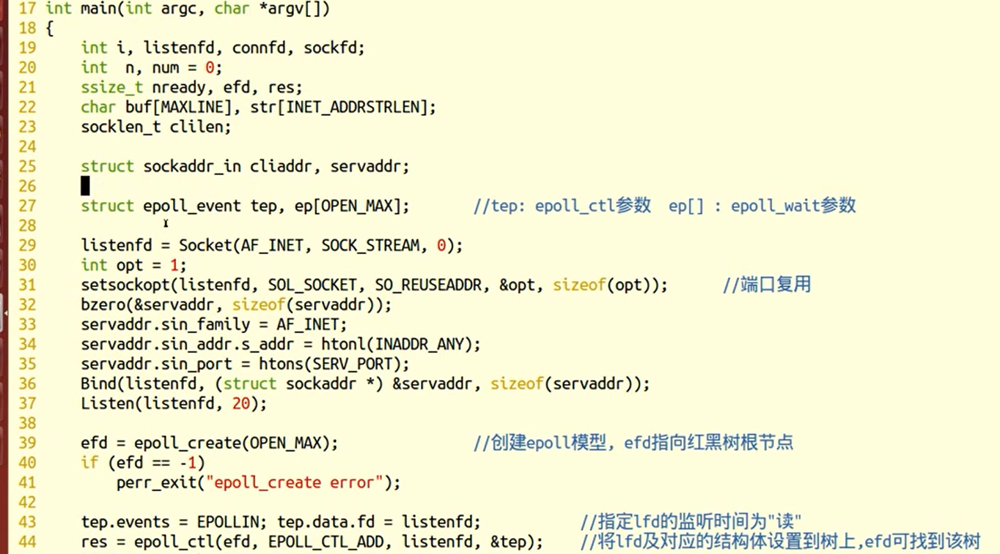

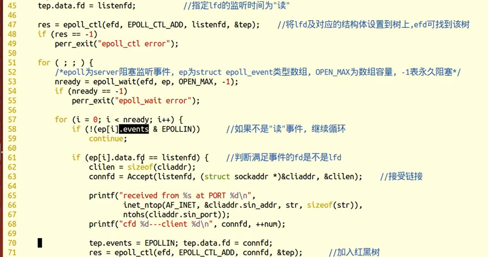

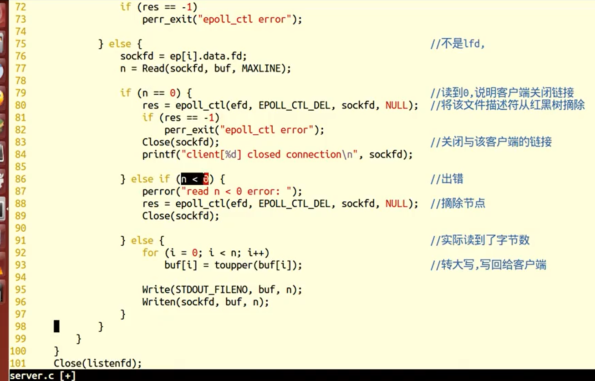


## epoll边缘触发

### 事件模型

EPOLL事件有两种模型：

- **Edge Triggered (ET) 边缘触发只有数据到来才触发，不管缓存区中是否还有数据。**
- **Level Triggered (LT) 水平触发只要有数据都会触发。**

**思考如下步骤：**

```c++
1. 假定我们已经把一个用来从管道中读取数据的文件描述符(RFD)添加到epoll描述符。

2. 管道的另一端写入了2KB的数据

3. 调用epoll_wait，并且它会返回RFD，说明它已经准备好读取操作

4. 读取1KB的数据

5. 调用epoll_wait……
```


**在这个过程中，有两种工作模式：**

#### ET模式

ET模式即Edge Triggered工作模式。

​		如果我们在第1步将RFD添加到epoll描述符的时候使用了**EPOLLET标志**，那么在第5步调用epoll_wait之后将有可能会挂起，因为剩余的数据还存在于文件的输入缓冲区内，而且数据发出端还在等待一个针对已经发出数据的反馈信息。只有在监视的文件句柄上发生了某个事件的时候 ET 工作模式才会汇报事件。因此在第5步的时候，调用者可能会放弃等待仍在存在于文件输入缓冲区内的剩余数据。epoll工作在ET模式的时候，必须使用非阻塞套接口，以避免由于一个文件句柄的阻塞读/阻塞写操作把处理多个文件描述符的任务饿死。最好以下面的方式调用ET模式的epoll接口，在后面会介绍避免可能的缺陷。

1.  **基于非阻塞文件句柄**

2.  **只有当read或者write返回EAGAIN(非阻塞读，暂时无数据)时才需要挂起、等待**。但这并不是说每次read时都需要循环读，直到读到产生一个EAGAIN才认为此次事件处理完成，当read返回的读到的数据长度小于请求的数据长度时，就可以确定此时缓冲中已没有数据了，也就可以认为此事读事件已处理完成。

#### LT模式

LT模式即Level Triggered工作模式。

与ET模式不同的是，以LT方式调用epoll接口的时候，它就相当于一个速度比较快的poll，无论后面的数据是否被使用。

**LT(level triggered)**：**LT是缺省的工作方式**，并且**同时支持block和no-block socket**。在这种做法中，内核告诉你一个文件描述符是否就绪了，然后你可以对这个就绪的fd进行IO操作。如果你不作任何操作，内核还是会继续通知你的，所以，这种模式编程出错误可能性要小一点。传统的select/poll都是这种模型的代表。

**ET(edge-triggered)：ET是高速工作方式，只支持no-block socket。**在这种模式下，当描述符从未就绪变为就绪时，内核通过epoll告诉你。然后它会假设你知道文件描述符已经就绪，并且不会再为那个文件描述符发送更多的就绪通知。请注意，如果一直不对这个fd作IO操作(从而导致它再次变成未就绪)，内核不会发送更多的通知(only once).

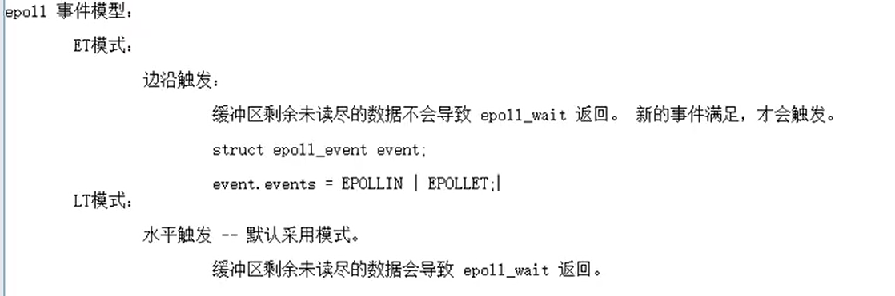

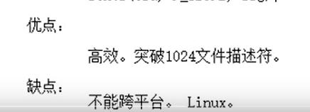


### epoll的ET非阻塞模型

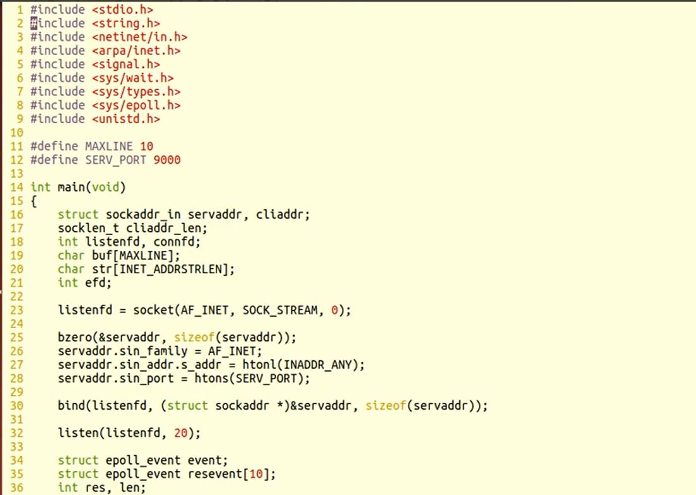

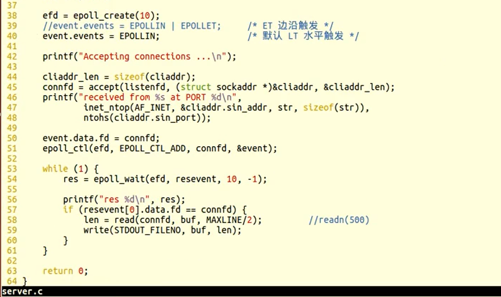


### 实例一：

基于管道epoll ET触发模式

 

```
#include <stdio.h>

\#include <stdlib.h>

\#include <sys/epoll.h>

\#include <errno.h>

\#include <unistd.h>

 

\#define MAXLINE 10

 

int main(int argc, char *argv[])

{

  int efd, i;

  int pfd[2];

  pid_t pid;

  char buf[MAXLINE], ch = 'a';

 

  pipe(pfd);

  pid = fork();

  if (pid == 0) {

​    close(pfd[0]);

​    while (1) {

​      for (i = 0; i < MAXLINE/2; i++)

​        buf[i] = ch;

​      buf[i-1] = '\n';

​      ch++;

 

​      for (; i < MAXLINE; i++)

​        buf[i] = ch;

​      buf[i-1] = '\n';

​      ch++;

 

​      write(pfd[1], buf, sizeof(buf));

​      sleep(2);

​    }

​    close(pfd[1]);

  } else if (pid > 0) {

​    struct epoll_event event;

​    struct epoll_event resevent[10];

​    int res, len;

​    close(pfd[1]);

 

​    efd = epoll_create(10);

​    /* event.events = EPOLLIN; */

​    event.events = EPOLLIN | EPOLLET;   /* ET 边沿触发 ，默认是水平触发 */

​    event.data.fd = pfd[0];

  epoll_ctl(efd, EPOLL_CTL_ADD, pfd[0], &event);

 

​    while (1) {

​      res = epoll_wait(efd, resevent, 10, -1);

​      printf("res %d\n", res);

​      if (resevent[0].data.fd == pfd[0]) {

​        len = read(pfd[0], buf, MAXLINE/2);

​        write(STDOUT_FILENO, buf, len);

​      }

​    }

​    close(pfd[0]);

​    close(efd);

  } else {

​    perror("fork");

​    exit(-1);

  }

  return 0;

}
```


### 实例二：

基于网络C/S模型的epoll ET触发模式

#### server

```
/* server.c */

\#include <stdio.h>

\#include <string.h>

\#include <netinet/in.h>

\#include <arpa/inet.h>

\#include <signal.h>

\#include <sys/wait.h>

\#include <sys/types.h>

\#include <sys/epoll.h>

\#include <unistd.h>

 

\#define MAXLINE 10

\#define SERV_PORT 8080

 

int main(void)

{

  struct sockaddr_in servaddr, cliaddr;

  socklen_t cliaddr_len;

  int listenfd, connfd;

  char buf[MAXLINE];

  char str[INET_ADDRSTRLEN];

  int i, efd;

 

  listenfd = socket(AF_INET, SOCK_STREAM, 0);

 

  bzero(&servaddr, sizeof(servaddr));

  servaddr.sin_family = AF_INET;

  servaddr.sin_addr.s_addr = htonl(INADDR_ANY);

  servaddr.sin_port = htons(SERV_PORT);

 

  bind(listenfd, (struct sockaddr *)&servaddr, sizeof(servaddr));

 

  listen(listenfd, 20);

 

  struct epoll_event event;

  struct epoll_event resevent[10];

  int res, len;

  efd = epoll_create(10);

  event.events = EPOLLIN | EPOLLET;   /* ET 边沿触发 ，默认是水平触发 */

 

  printf("Accepting connections ...\n");

  cliaddr_len = sizeof(cliaddr);

  connfd = accept(listenfd, (struct sockaddr *)&cliaddr, &cliaddr_len);

  printf("received from %s at PORT %d\n",

​      inet_ntop(AF_INET, &cliaddr.sin_addr, str, sizeof(str)),

​      ntohs(cliaddr.sin_port));

 

  event.data.fd = connfd;

  epoll_ctl(efd, EPOLL_CTL_ADD, connfd, &event);

 

  while (1) {

​    res = epoll_wait(efd, resevent, 10, -1);

​    printf("res %d\n", res);

​    if (resevent[0].data.fd == connfd) {

​      len = read(connfd, buf, MAXLINE/2);

​      write(STDOUT_FILENO, buf, len);

​    }

  }

  return 0;

}
```


#### client

```
/* client.c */

\#include <stdio.h>

\#include <string.h>

\#include <unistd.h>

\#include <netinet/in.h>

 

\#define MAXLINE 10

\#define SERV_PORT 8080

 

int main(int argc, char *argv[])

{

  struct sockaddr_in servaddr;

  char buf[MAXLINE];

  int sockfd, i;

  char ch = 'a';

 

  sockfd = socket(AF_INET, SOCK_STREAM, 0);

 

  bzero(&servaddr, sizeof(servaddr));

  servaddr.sin_family = AF_INET;

  inet_pton(AF_INET, "127.0.0.1", &servaddr.sin_addr);

  servaddr.sin_port = htons(SERV_PORT);

 

  connect(sockfd, (struct sockaddr *)&servaddr, sizeof(servaddr));

 

  while (1) {

​    for (i = 0; i < MAXLINE/2; i++)

​      buf[i] = ch;

​    buf[i-1] = '\n';

​    ch++;

 

​    for (; i < MAXLINE; i++)

​      buf[i] = ch;

​    buf[i-1] = '\n';

​    ch++;

 

​    write(sockfd, buf, sizeof(buf));

​    sleep(10);

  }

  Close(sockfd);

  return 0;

}
```


### 实例三：

基于网络C/S非阻塞模型的epoll ET触发模式

#### server

```

/* server.c */

\#include <stdio.h>

\#include <string.h>

\#include <netinet/in.h>

\#include <arpa/inet.h>

\#include <sys/wait.h>

\#include <sys/types.h>

\#include <sys/epoll.h>

\#include <unistd.h>

\#include <fcntl.h>

 

\#define MAXLINE 10

\#define SERV_PORT 8080

 

int main(void)

{

  struct sockaddr_in servaddr, cliaddr;

  socklen_t cliaddr_len;

  int listenfd, connfd;

  char buf[MAXLINE];

  char str[INET_ADDRSTRLEN];

  int i, efd, flag;

 

  listenfd = socket(AF_INET, SOCK_STREAM, 0);

 

  bzero(&servaddr, sizeof(servaddr));

  servaddr.sin_family = AF_INET;

  servaddr.sin_addr.s_addr = htonl(INADDR_ANY);

  servaddr.sin_port = htons(SERV_PORT);

 

  bind(listenfd, (struct sockaddr *)&servaddr, sizeof(servaddr));

 

  listen(listenfd, 20);

 

  struct epoll_event event;

  struct epoll_event resevent[10];

  int res, len;

  efd = epoll_create(10);

  /* event.events = EPOLLIN; */

  event.events = EPOLLIN | EPOLLET;   /* ET 边沿触发 ，默认是水平触发 */

 

  printf("Accepting connections ...\n");

  cliaddr_len = sizeof(cliaddr);

  connfd = accept(listenfd, (struct sockaddr *)&cliaddr, &cliaddr_len);

  printf("received from %s at PORT %d\n",

​      inet_ntop(AF_INET, &cliaddr.sin_addr, str, sizeof(str)),

​      ntohs(cliaddr.sin_port));

 

  flag = fcntl(connfd, F_GETFL);

  flag |= O_NONBLOCK;

  fcntl(connfd, F_SETFL, flag);

  event.data.fd = connfd;

  epoll_ctl(efd, EPOLL_CTL_ADD, connfd, &event);

 

  while (1) {

​    printf("epoll_wait begin\n");

​    res = epoll_wait(efd, resevent, 10, -1);

​    printf("epoll_wait end res %d\n", res);

 

​    if (resevent[0].data.fd == connfd) {

​      while ((len = read(connfd, buf, MAXLINE/2)) > 0)

​        write(STDOUT_FILENO, buf, len);

​    }

  }

  return 0;

}
```


#### client

```
/* client.c */

\#include <stdio.h>

\#include <string.h>

\#include <unistd.h>

\#include <netinet/in.h>

 

\#define MAXLINE 10

\#define SERV_PORT 8080

 

int main(int argc, char *argv[])

{

  struct sockaddr_in servaddr;

  char buf[MAXLINE];

  int sockfd, i;

  char ch = 'a';

 

  sockfd = socket(AF_INET, SOCK_STREAM, 0);

 

  bzero(&servaddr, sizeof(servaddr));

  servaddr.sin_family = AF_INET;

  inet_pton(AF_INET, "127.0.0.1", &servaddr.sin_addr);

  servaddr.sin_port = htons(SERV_PORT);

 

  connect(sockfd, (struct sockaddr *)&servaddr, sizeof(servaddr));

 

  while (1) {

​    for (i = 0; i < MAXLINE/2; i++)

​      buf[i] = ch;

​    buf[i-1] = '\n';

​    ch++;

 

​    for (; i < MAXLINE; i++)

​      buf[i] = ch;

​    buf[i-1] = '\n';

​    ch++;

 

​    write(sockfd, buf, sizeof(buf));

​    sleep(10);

  }

  Close(sockfd);

  return 0;

}
```


## epoll反应堆

epoll 反应堆模型：

```c
epoll ET模式 + 非阻塞、轮询 + void *ptr。

原来：	socket、bind、listen -- epoll_create 创建监听 红黑树 --  返回 epfd -- epoll_ctl() 向树上添加一个监听fd -- while（1）--

	-- epoll_wait 监听 -- 对应监听fd有事件产生 -- 返回 监听满足数组。 -- 判断返回数组元素 -- lfd满足 -- Accept -- cfd 满足 

	-- read() --- 小->大 -- write回去。

反应堆：不但要监听 cfd 的读事件、还要监听cfd的写事件。

	socket、bind、listen -- epoll_create 创建监听 红黑树 --  返回 epfd -- epoll_ctl() 向树上添加一个监听fd -- while（1）--

	-- epoll_wait 监听 -- 对应监听fd有事件产生 -- 返回 监听满足数组。 -- 判断返回数组元素 -- lfd满足 -- Accept -- cfd 满足 

	-- read() --- 小->大 -- cfd从监听红黑树上摘下 -- EPOLLOUT -- 回调函数 -- epoll_ctl() -- EPOLL_CTL_ADD 重新放到红黑上监听写事件

	-- 等待 epoll_wait 返回 -- 说明 cfd 可写 -- write回去 -- cfd从监听红黑树上摘下 -- EPOLLIN 

	-- epoll_ctl() -- EPOLL_CTL_ADD 重新放到红黑上监听读事件 -- epoll_wait 监听

eventset函数：

	设置回调函数。   lfd --> acceptconn()

					cfd --> recvdata();

					cfd --> senddata();
eventadd函数：

	将一个fd， 添加到 监听红黑树。  设置监听 read事件，还是监听写事件。

网络编程中：  	read --- recv()

		write --- send();
```


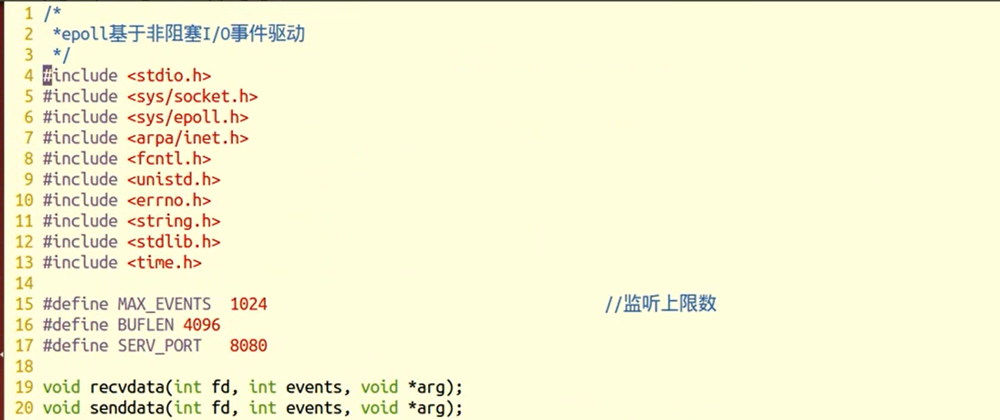

#### 自定义结构体

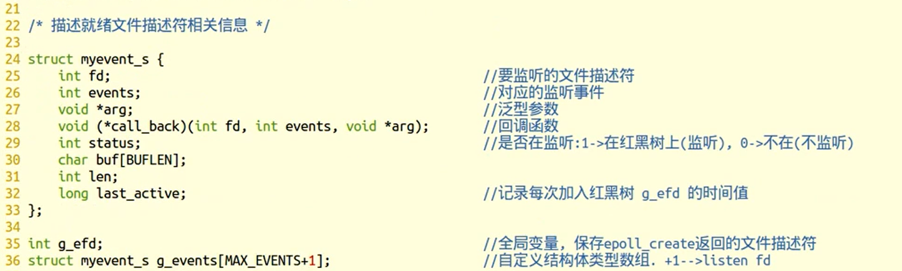

#### 初始化自定义结构体（操作）

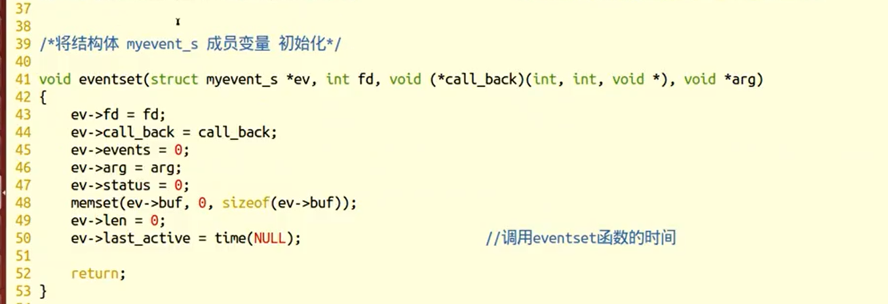

#### 在红黑树中增加文件描述符（操作）

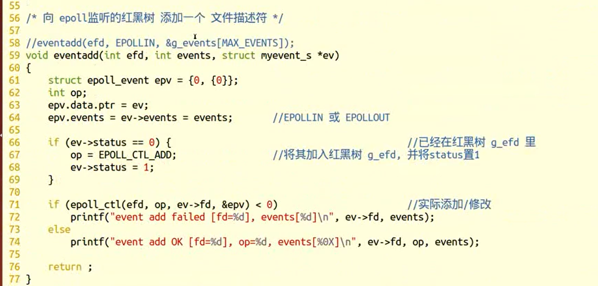

#### 在红黑树中删除一个文件描述符（操作）

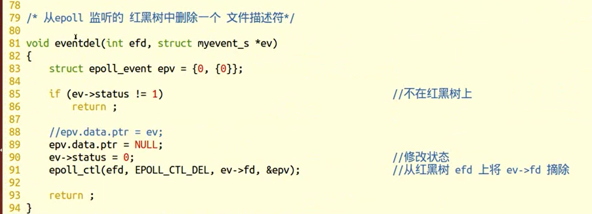

#### connect（回调函数）

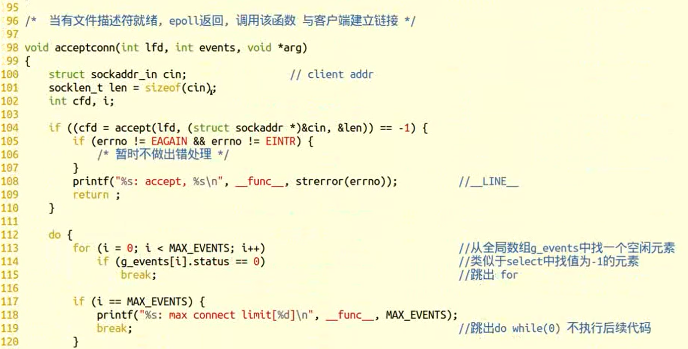

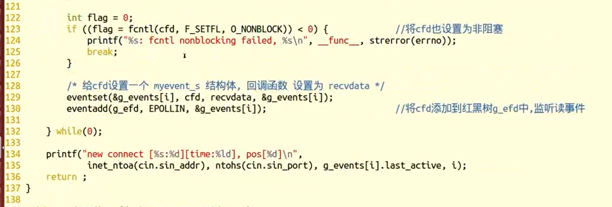

#### 接收数据（回调函数）

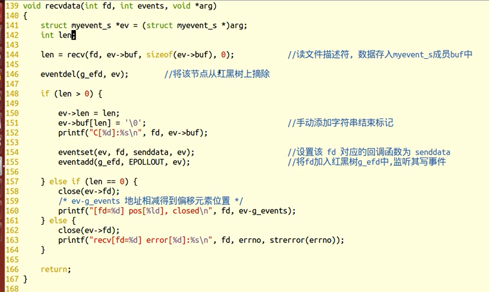

#### 发送数据（回到函数）

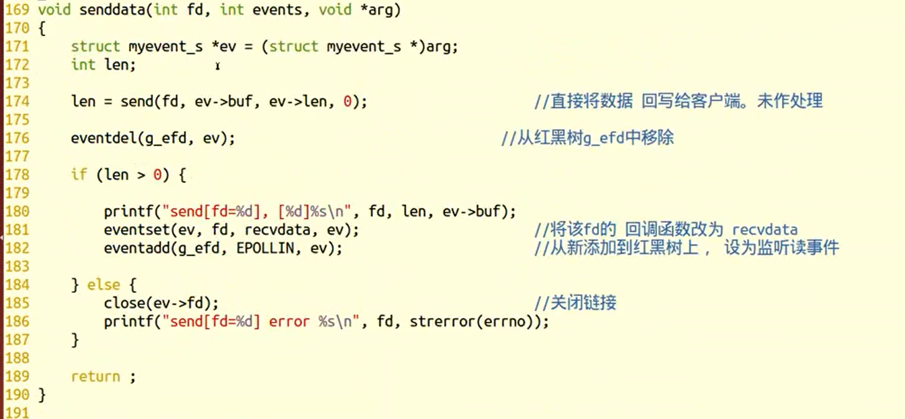

#### 初始化lfd（操作）

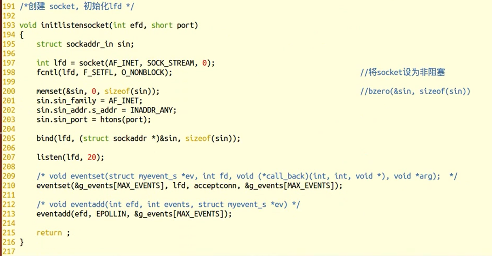

#### main函数

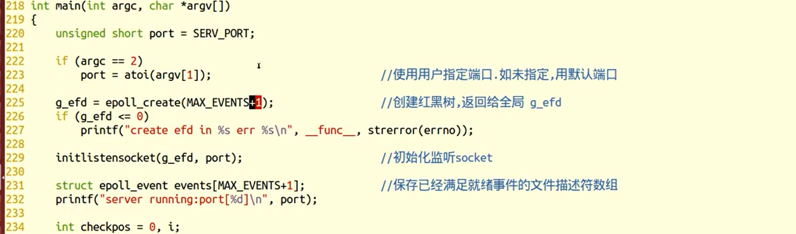

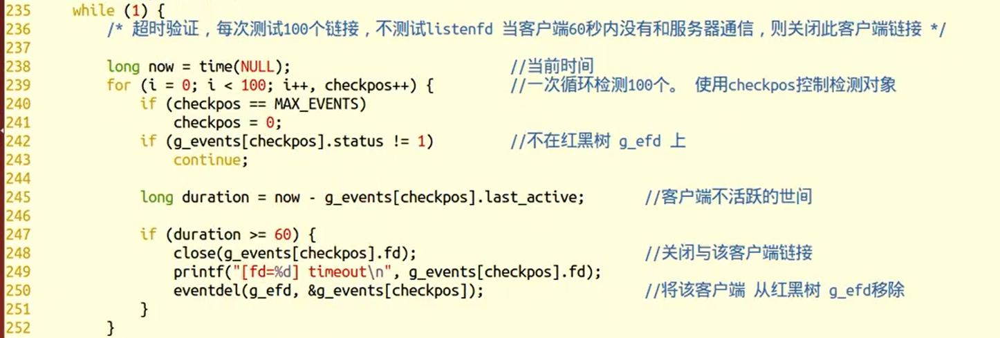

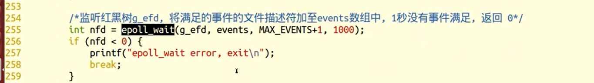

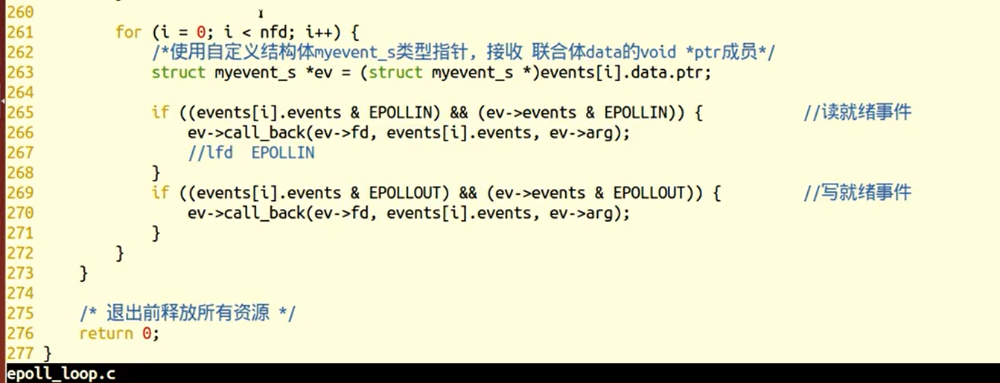


