## 线程池并发服务器

1. 预先创建阻塞于accept多线程，使用互斥锁上锁保护accept

2. 预先创建多线程，由主线程调用accept


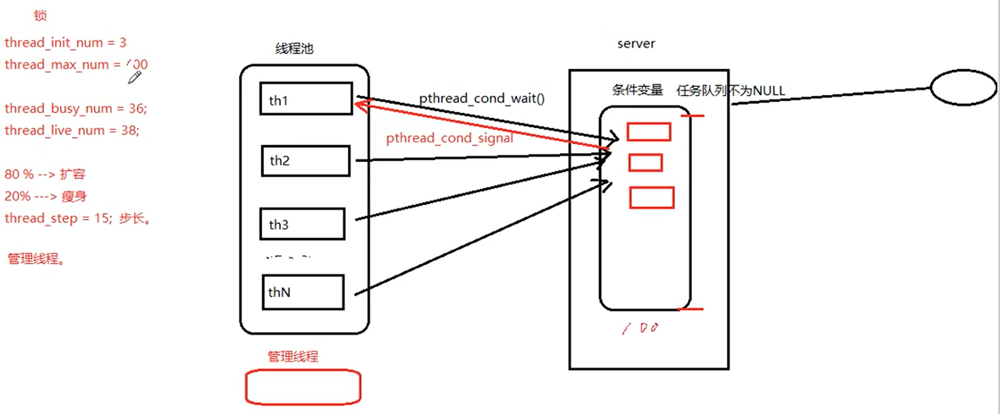

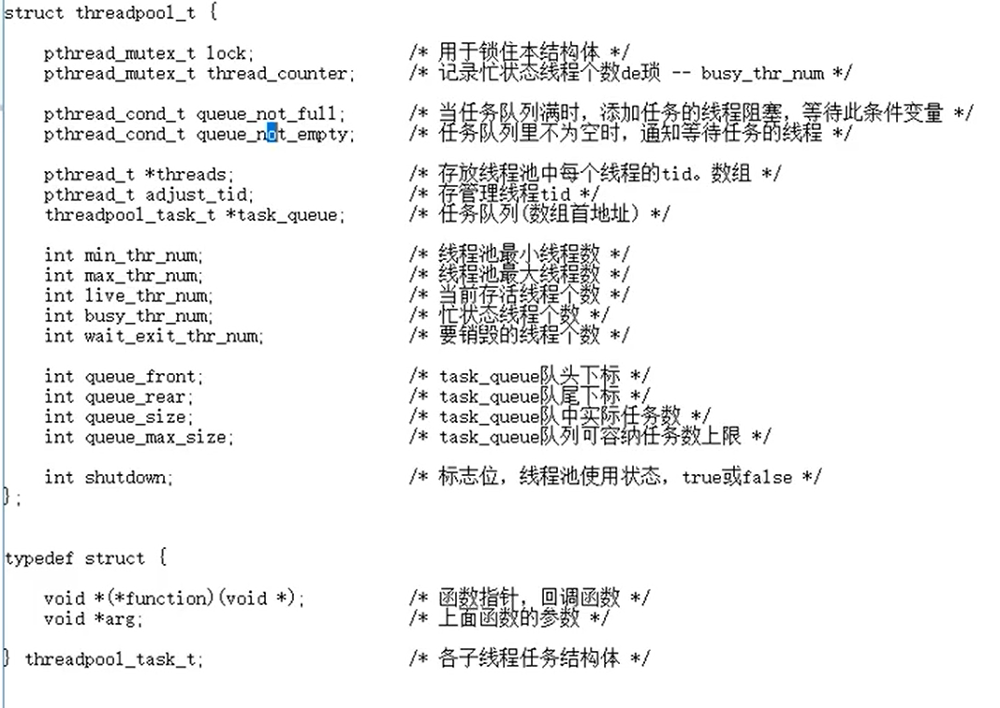

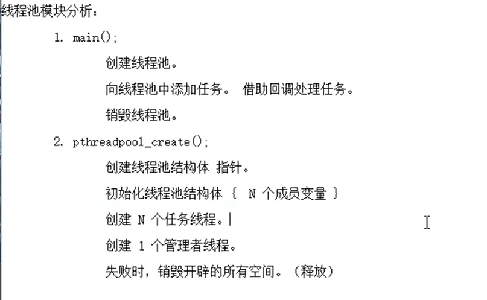

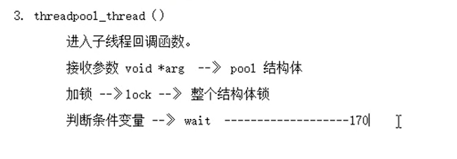

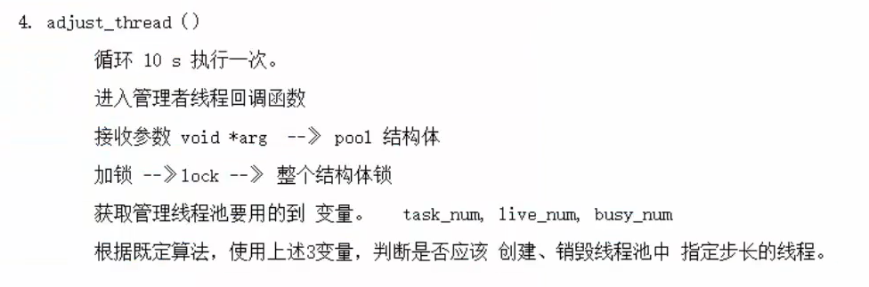

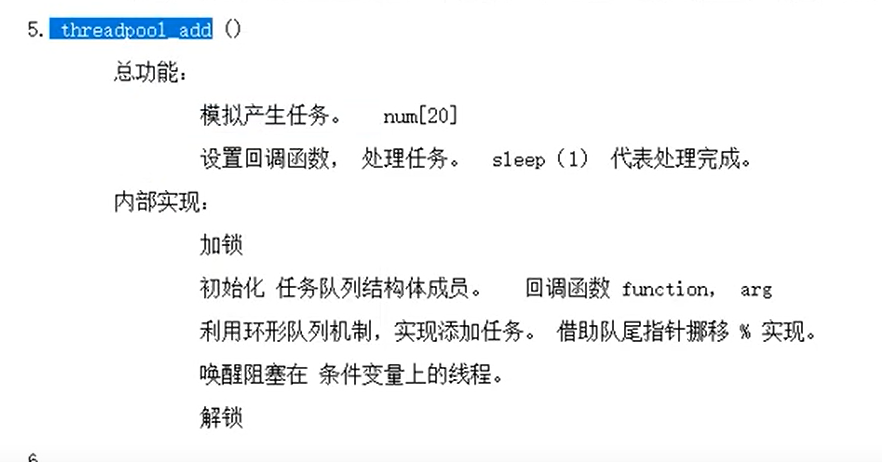

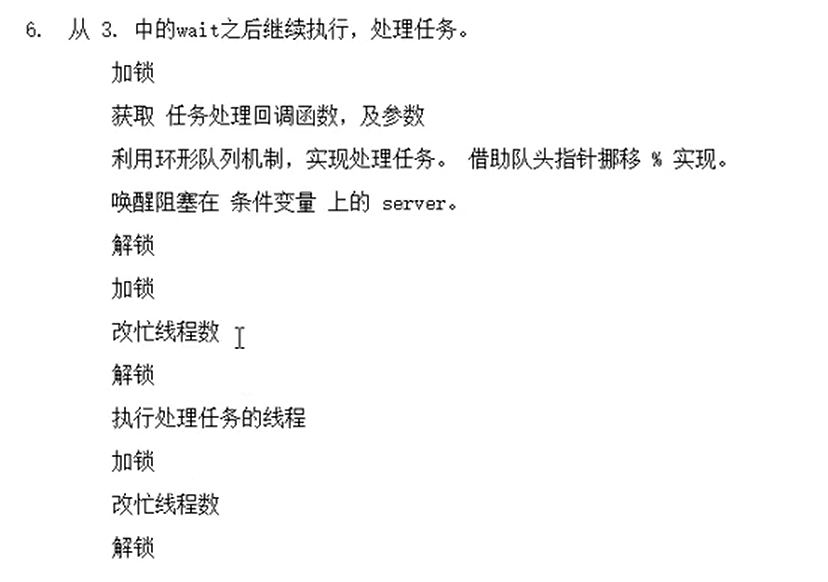

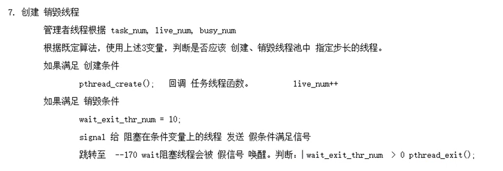

线程池模块分析：
	1. main();	
		创建线程池。
	
		向线程池中添加任务。 借助回调处理任务。
	
		销毁线程池。
	
	2. pthreadpool_create();
	
		创建线程池结构体 指针。
	
		初始化线程池结构体 {  N 个成员变量 }
	
		创建 N 个任务线程。
	
		创建 1 个管理者线程。
	
		失败时，销毁开辟的所有空间。（释放）
	
	3. threadpool_thread（）
	
		进入子线程回调函数。
	
		接收参数 void *arg  --》 pool 结构体
	
		加锁 --》lock --》 整个结构体锁
	
		判断条件变量 --》 wait  -------------------170
	
	4. adjust_thread（）
	
		循环 10 s 执行一次。
	
		进入管理者线程回调函数
	
		接收参数 void *arg  --》 pool 结构体
	
		加锁 --》lock --》 整个结构体锁
	
		获取管理线程池要用的到 变量。	task_num, live_num, busy_num
	
		根据既定算法，使用上述3变量，判断是否应该 创建、销毁线程池中 指定步长的线程。
	
	5. threadpool_add ()
	
		总功能：
	
			模拟产生任务。   num[20]
	
			设置回调函数， 处理任务。  sleep（1） 代表处理完成。
	
		内部实现：
	
			加锁
	
			初始化 任务队列结构体成员。   回调函数 function， arg
	
			利用环形队列机制，实现添加任务。 借助队尾指针挪移 % 实现。
	
			唤醒阻塞在 条件变量上的线程。
	
			解锁
	
	6.  从 3. 中的wait之后继续执行，处理任务。
	
		加锁
		
		获取 任务处理回调函数，及参数
	
		利用环形队列机制，实现处理任务。 借助队头指针挪移 % 实现。
	
		唤醒阻塞在 条件变量 上的 server。
	
		解锁
	
		加锁 
	
		改忙线程数++
	
		解锁
	
		执行处理任务的线程
	
		加锁 
	
		改忙线程数——
	
		解锁
	
	7. 创建 销毁线程
	
		管理者线程根据 task_num, live_num, busy_num  
	
		根据既定算法，使用上述3变量，判断是否应该 创建、销毁线程池中 指定步长的线程。
	
		如果满足 创建条件
	
			pthread_create();   回调 任务线程函数。		live_num++
	
		如果满足 销毁条件
	
			wait_exit_thr_num = 10;  
	
			signal 给 阻塞在条件变量上的线程 发送 假条件满足信号    
	
			跳转至  --170 wait阻塞线程会被 假信号 唤醒。判断： wait_exit_thr_num  > 0 pthread_exit();          


### threadpollServer


#### 线程池结构体

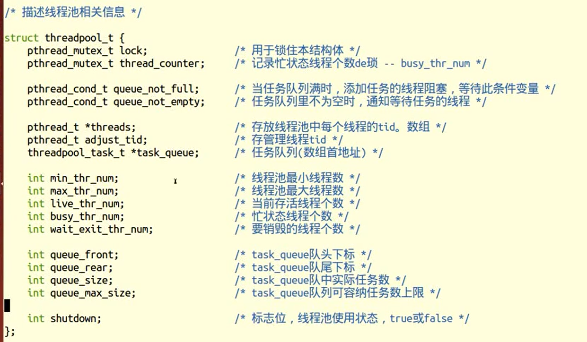

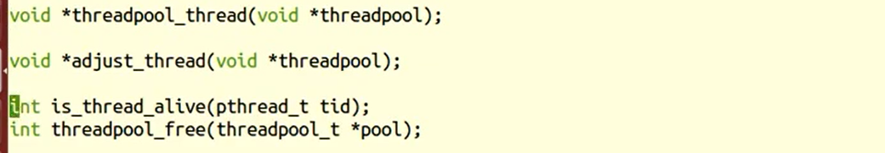

#### threadpollCreate

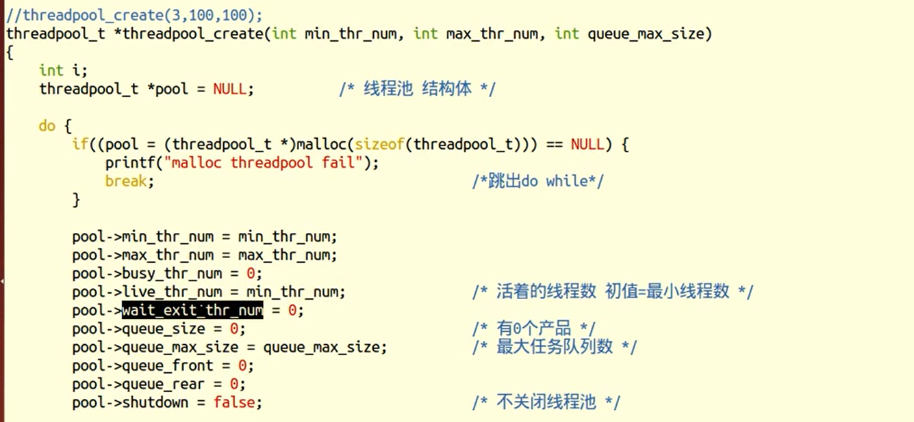

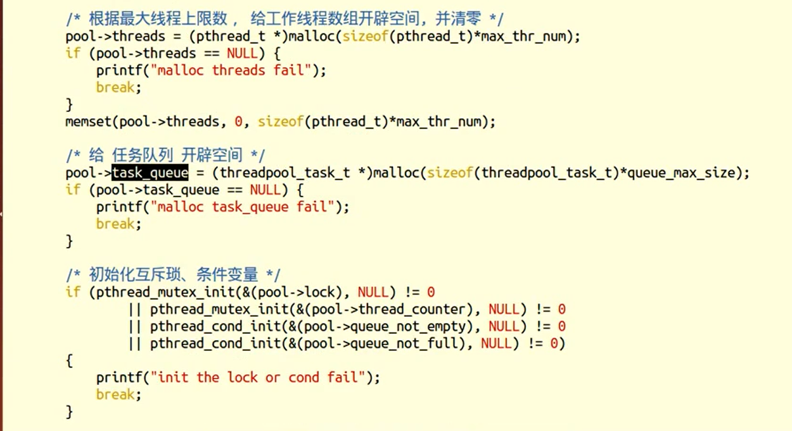

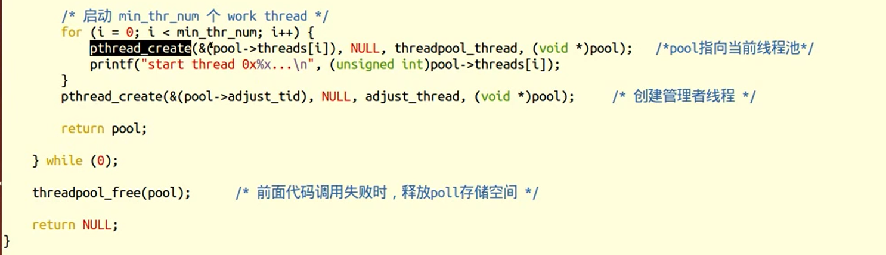


#### threadpoll_add

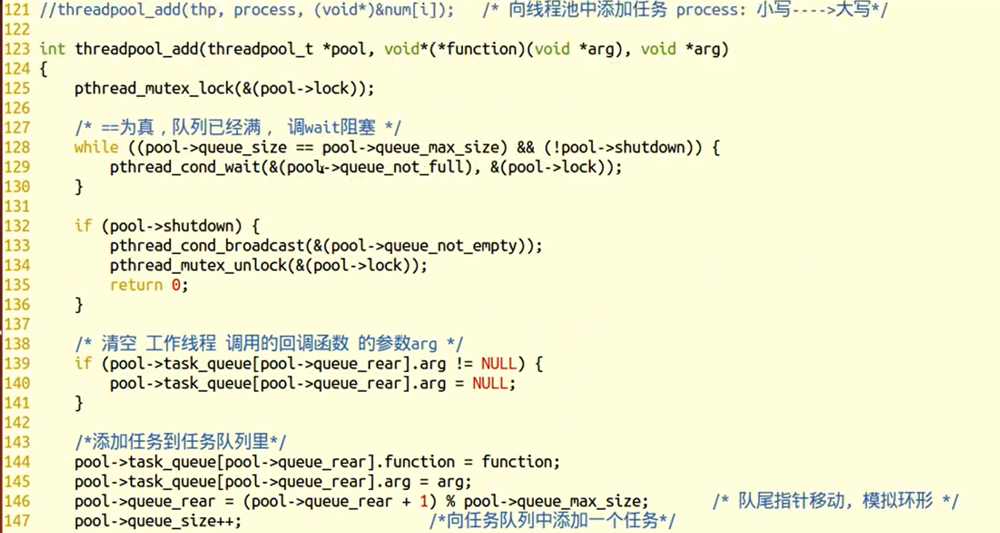

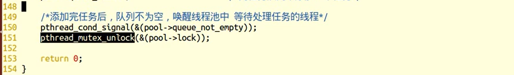


#### 子线程回调函数

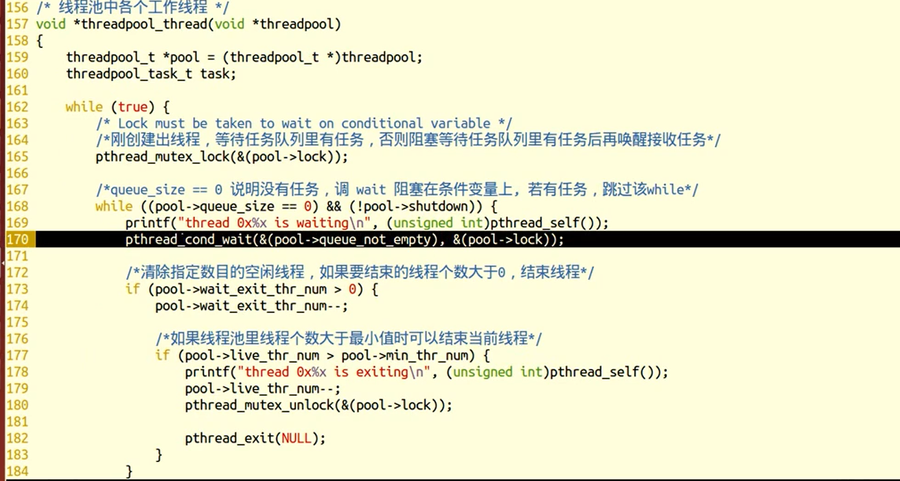

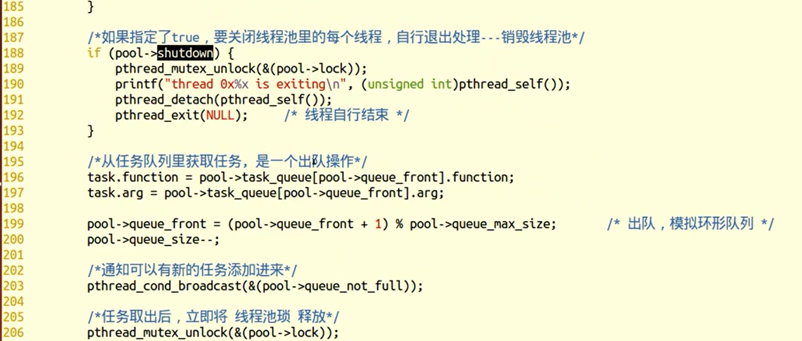

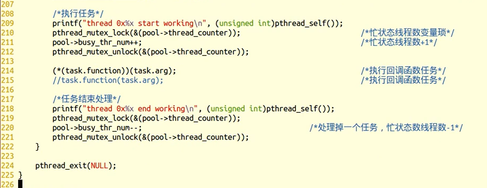


#### 管理者线程

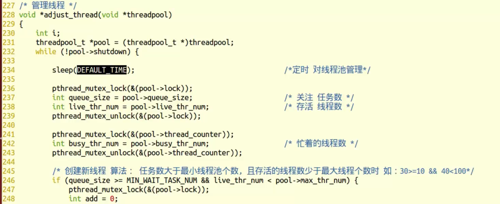

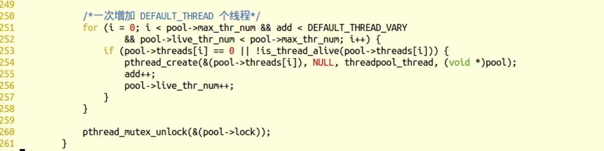

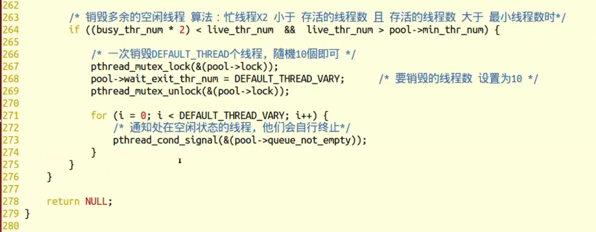


#### 线程池销毁

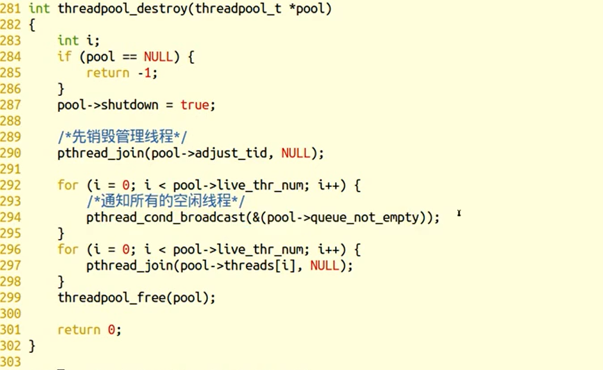

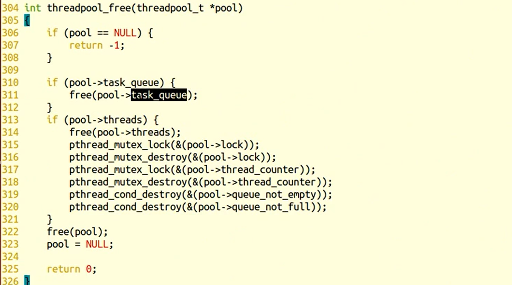


#### 线程池main架构

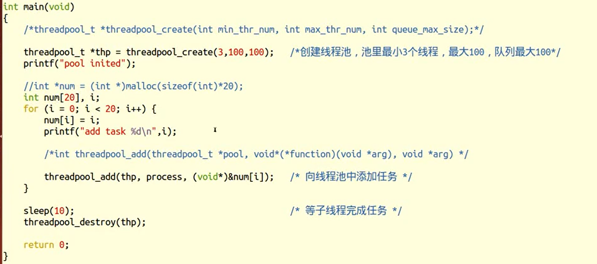


#### threadpool.h

```c
#ifndef __THREADPOOL_H_
#define __THREADPOOL_H_

typedef struct threadpool_t threadpool_t;

/**
 * @function threadpool_create
 * @descCreates a threadpool_t object.
 * @param thr_num  thread num
 * @param max_thr_num  max thread size
 * @param queue_max_size   size of the queue.
 * @return a newly created thread pool or NULL
 */
threadpool_t *threadpool_create(int min_thr_num, int max_thr_num, int queue_max_size);

/**
 * @function threadpool_add
 * @desc add a new task in the queue of a thread pool
 * @param pool     Thread pool to which add the task.
 * @param function Pointer to the function that will perform the task.
 * @param argument Argument to be passed to the function.
 * @return 0 if all goes well,else -1
 */
int threadpool_add(threadpool_t *pool, void*(*function)(void *arg), void *arg);

/**
 * @function threadpool_destroy
 * @desc Stops and destroys a thread pool.
 * @param pool  Thread pool to destroy.
 * @return 0 if destory success else -1
 */
int threadpool_destroy(threadpool_t *pool);

/**
 * @desc get the thread num
 * @pool pool threadpool
 * @return # of the thread
 */
int threadpool_all_threadnum(threadpool_t *pool);

/**
 * desc get the busy thread num
 * @param pool threadpool
 * return # of the busy thread
 */
int threadpool_busy_threadnum(threadpool_t *pool);

#endif

```


#### threadpool.c

```c
#include <stdlib.h>
#include <pthread.h>
#include <unistd.h>
#include <assert.h>
#include <stdio.h>
#include <string.h>
#include <signal.h>
#include <errno.h>
#include "threadpool.h"

#define DEFAULT_TIME 10                 /*10s检测一次*/
#define MIN_WAIT_TASK_NUM 10            /*如果queue_size > MIN_WAIT_TASK_NUM 添加新的线程到线程池*/ 
#define DEFAULT_THREAD_VARY 10          /*每次创建和销毁线程的个数*/
#define true 1
#define false 0

typedef struct {
    void *(*function)(void *);          /* 函数指针，回调函数 */
    void *arg;                          /* 上面函数的参数 */
} threadpool_task_t;                    /* 各子线程任务结构体 */

/* 描述线程池相关信息 */

struct threadpool_t {
    pthread_mutex_t lock;               /* 用于锁住本结构体 */    
    pthread_mutex_t thread_counter;     /* 记录忙状态线程个数de琐 -- busy_thr_num */

    pthread_cond_t queue_not_full;      /* 当任务队列满时，添加任务的线程阻塞，等待此条件变量 */
    pthread_cond_t queue_not_empty;     /* 任务队列里不为空时，通知等待任务的线程 */

    pthread_t *threads;                 /* 存放线程池中每个线程的tid。数组 */
    pthread_t adjust_tid;               /* 存管理线程tid */
    threadpool_task_t *task_queue;      /* 任务队列(数组首地址) */

    int min_thr_num;                    /* 线程池最小线程数 */
    int max_thr_num;                    /* 线程池最大线程数 */
    int live_thr_num;                   /* 当前存活线程个数 */
    int busy_thr_num;                   /* 忙状态线程个数 */
    int wait_exit_thr_num;              /* 要销毁的线程个数 */

    int queue_front;                    /* task_queue队头下标 */
    int queue_rear;                     /* task_queue队尾下标 */
    int queue_size;                     /* task_queue队中实际任务数 */
    int queue_max_size;                 /* task_queue队列可容纳任务数上限 */

    int shutdown;                       /* 标志位，线程池使用状态，true或false */
};

void *threadpool_thread(void *threadpool);

void *adjust_thread(void *threadpool);

int is_thread_alive(pthread_t tid);
int threadpool_free(threadpool_t *pool);

//threadpool_create(3,100,100);  
threadpool_t *threadpool_create(int min_thr_num, int max_thr_num, int queue_max_size)
{
    int i;
    threadpool_t *pool = NULL;          /* 线程池 结构体 */

    do {
        if((pool = (threadpool_t *)malloc(sizeof(threadpool_t))) == NULL) {  
            printf("malloc threadpool fail");
            break;                                      /*跳出do while*/
        }

        pool->min_thr_num = min_thr_num;
        pool->max_thr_num = max_thr_num;
        pool->busy_thr_num = 0;
        pool->live_thr_num = min_thr_num;               /* 活着的线程数 初值=最小线程数 */
        pool->wait_exit_thr_num = 0;
        pool->queue_size = 0;                           /* 有0个产品 */
        pool->queue_max_size = queue_max_size;          /* 最大任务队列数 */
        pool->queue_front = 0;
        pool->queue_rear = 0;
        pool->shutdown = false;                         /* 不关闭线程池 */

        /* 根据最大线程上限数， 给工作线程数组开辟空间, 并清零 */
        pool->threads = (pthread_t *)malloc(sizeof(pthread_t)*max_thr_num); 
        if (pool->threads == NULL) {
            printf("malloc threads fail");
            break;
        }
        memset(pool->threads, 0, sizeof(pthread_t)*max_thr_num);

        /* 给 任务队列 开辟空间 */
        pool->task_queue = (threadpool_task_t *)malloc(sizeof(threadpool_task_t)*queue_max_size);
        if (pool->task_queue == NULL) {
            printf("malloc task_queue fail");
            break;
        }

        /* 初始化互斥琐、条件变量 */
        if (pthread_mutex_init(&(pool->lock), NULL) != 0
                || pthread_mutex_init(&(pool->thread_counter), NULL) != 0
                || pthread_cond_init(&(pool->queue_not_empty), NULL) != 0
                || pthread_cond_init(&(pool->queue_not_full), NULL) != 0)
        {
            printf("init the lock or cond fail");
            break;
        }

        /* 启动 min_thr_num 个 work thread */
        for (i = 0; i < min_thr_num; i++) {
            pthread_create(&(pool->threads[i]), NULL, threadpool_thread, (void *)pool);   /*pool指向当前线程池*/
            printf("start thread 0x%x...\n", (unsigned int)pool->threads[i]);
        }
        pthread_create(&(pool->adjust_tid), NULL, adjust_thread, (void *)pool);     /* 创建管理者线程 */

        return pool;

    } while (0);

    threadpool_free(pool);      /* 前面代码调用失败时，释放poll存储空间 */

    return NULL;
}

/* 向线程池中 添加一个任务 */
//threadpool_add(thp, process, (void*)&num[i]);   /* 向线程池中添加任务 process: 小写---->大写*/

int threadpool_add(threadpool_t *pool, void*(*function)(void *arg), void *arg)
{
    pthread_mutex_lock(&(pool->lock));

    /* ==为真，队列已经满， 调wait阻塞 */
    while ((pool->queue_size == pool->queue_max_size) && (!pool->shutdown)) {
        pthread_cond_wait(&(pool->queue_not_full), &(pool->lock));
    }

    if (pool->shutdown) {
        pthread_cond_broadcast(&(pool->queue_not_empty));
        pthread_mutex_unlock(&(pool->lock));
        return 0;
    }

    /* 清空 工作线程 调用的回调函数 的参数arg */
    if (pool->task_queue[pool->queue_rear].arg != NULL) {
        pool->task_queue[pool->queue_rear].arg = NULL;
    }

    /*添加任务到任务队列里*/
    pool->task_queue[pool->queue_rear].function = function;
    pool->task_queue[pool->queue_rear].arg = arg;
    pool->queue_rear = (pool->queue_rear + 1) % pool->queue_max_size;       /* 队尾指针移动, 模拟环形 */
    pool->queue_size++;

    /*添加完任务后，队列不为空，唤醒线程池中 等待处理任务的线程*/
    pthread_cond_signal(&(pool->queue_not_empty));
    pthread_mutex_unlock(&(pool->lock));

    return 0;
}

/* 线程池中各个工作线程 */
void *threadpool_thread(void *threadpool)
{
    threadpool_t *pool = (threadpool_t *)threadpool;
    threadpool_task_t task;

    while (true) {
        /* Lock must be taken to wait on conditional variable */
        /*刚创建出线程，等待任务队列里有任务，否则阻塞等待任务队列里有任务后再唤醒接收任务*/
        pthread_mutex_lock(&(pool->lock));

        /*queue_size == 0 说明没有任务，调 wait 阻塞在条件变量上, 若有任务，跳过该while*/
        while ((pool->queue_size == 0) && (!pool->shutdown)) {  
            printf("thread 0x%x is waiting\n", (unsigned int)pthread_self());
            pthread_cond_wait(&(pool->queue_not_empty), &(pool->lock));

            /*清除指定数目的空闲线程，如果要结束的线程个数大于0，结束线程*/
            if (pool->wait_exit_thr_num > 0) {
                pool->wait_exit_thr_num--;

                /*如果线程池里线程个数大于最小值时可以结束当前线程*/
                if (pool->live_thr_num > pool->min_thr_num) {
                    printf("thread 0x%x is exiting\n", (unsigned int)pthread_self());
                    pool->live_thr_num--;
                    pthread_mutex_unlock(&(pool->lock));

                    pthread_exit(NULL);
                }
            }
        }

        /*如果指定了true，要关闭线程池里的每个线程，自行退出处理---销毁线程池*/
        if (pool->shutdown) {
            pthread_mutex_unlock(&(pool->lock));
            printf("thread 0x%x is exiting\n", (unsigned int)pthread_self());
            pthread_detach(pthread_self());
            pthread_exit(NULL);     /* 线程自行结束 */
        }

        /*从任务队列里获取任务, 是一个出队操作*/
        task.function = pool->task_queue[pool->queue_front].function;
        task.arg = pool->task_queue[pool->queue_front].arg;

        pool->queue_front = (pool->queue_front + 1) % pool->queue_max_size;       /* 出队，模拟环形队列 */
        pool->queue_size--;

        /*通知可以有新的任务添加进来*/
        pthread_cond_broadcast(&(pool->queue_not_full));

        /*任务取出后，立即将 线程池琐 释放*/
        pthread_mutex_unlock(&(pool->lock));

        /*执行任务*/ 
        printf("thread 0x%x start working\n", (unsigned int)pthread_self());
        pthread_mutex_lock(&(pool->thread_counter));                            /*忙状态线程数变量琐*/
        pool->busy_thr_num++;                                                   /*忙状态线程数+1*/
        pthread_mutex_unlock(&(pool->thread_counter));

        (*(task.function))(task.arg);                                           /*执行回调函数任务*/
        //task.function(task.arg);                                              /*执行回调函数任务*/

        /*任务结束处理*/ 
        printf("thread 0x%x end working\n", (unsigned int)pthread_self());
        pthread_mutex_lock(&(pool->thread_counter));
        pool->busy_thr_num--;                                       /*处理掉一个任务，忙状态数线程数-1*/
        pthread_mutex_unlock(&(pool->thread_counter));
    }

    pthread_exit(NULL);
}

/* 管理线程 */
void *adjust_thread(void *threadpool)
{
    int i;
    threadpool_t *pool = (threadpool_t *)threadpool;
    while (!pool->shutdown) {

        sleep(DEFAULT_TIME);                                    /*定时 对线程池管理*/

        pthread_mutex_lock(&(pool->lock));
        int queue_size = pool->queue_size;                      /* 关注 任务数 */
        int live_thr_num = pool->live_thr_num;                  /* 存活 线程数 */
        pthread_mutex_unlock(&(pool->lock));

        pthread_mutex_lock(&(pool->thread_counter));
        int busy_thr_num = pool->busy_thr_num;                  /* 忙着的线程数 */
        pthread_mutex_unlock(&(pool->thread_counter));

        /* 创建新线程 算法： 任务数大于最小线程池个数, 且存活的线程数少于最大线程个数时 如：30>=10 && 40<100*/
        if (queue_size >= MIN_WAIT_TASK_NUM && live_thr_num < pool->max_thr_num) {
            pthread_mutex_lock(&(pool->lock));  
            int add = 0;

            /*一次增加 DEFAULT_THREAD 个线程*/
            for (i = 0; i < pool->max_thr_num && add < DEFAULT_THREAD_VARY
                    && pool->live_thr_num < pool->max_thr_num; i++) {
                if (pool->threads[i] == 0 || !is_thread_alive(pool->threads[i])) {
                    pthread_create(&(pool->threads[i]), NULL, threadpool_thread, (void *)pool);
                    add++;
                    pool->live_thr_num++;
                }
            }

            pthread_mutex_unlock(&(pool->lock));
        }

        /* 销毁多余的空闲线程 算法：忙线程X2 小于 存活的线程数 且 存活的线程数 大于 最小线程数时*/
        if ((busy_thr_num * 2) < live_thr_num  &&  live_thr_num > pool->min_thr_num) {

            /* 一次销毁DEFAULT_THREAD个线程, 隨機10個即可 */
            pthread_mutex_lock(&(pool->lock));
            pool->wait_exit_thr_num = DEFAULT_THREAD_VARY;      /* 要销毁的线程数 设置为10 */
            pthread_mutex_unlock(&(pool->lock));

            for (i = 0; i < DEFAULT_THREAD_VARY; i++) {
                /* 通知处在空闲状态的线程, 他们会自行终止*/
                pthread_cond_signal(&(pool->queue_not_empty));
            }
        }
    }

    return NULL;
}

int threadpool_destroy(threadpool_t *pool)
{
    int i;
    if (pool == NULL) {
        return -1;
    }
    pool->shutdown = true;

    /*先销毁管理线程*/
    pthread_join(pool->adjust_tid, NULL);

    for (i = 0; i < pool->live_thr_num; i++) {
        /*通知所有的空闲线程*/
        pthread_cond_broadcast(&(pool->queue_not_empty));
    }
    for (i = 0; i < pool->live_thr_num; i++) {
        pthread_join(pool->threads[i], NULL);
    }
    threadpool_free(pool);

    return 0;
}

int threadpool_free(threadpool_t *pool)
{
    if (pool == NULL) {
        return -1;
    }

    if (pool->task_queue) {
        free(pool->task_queue);
    }
    if (pool->threads) {
        free(pool->threads);
        pthread_mutex_lock(&(pool->lock));
        pthread_mutex_destroy(&(pool->lock));
        pthread_mutex_lock(&(pool->thread_counter));
        pthread_mutex_destroy(&(pool->thread_counter));
        pthread_cond_destroy(&(pool->queue_not_empty));
        pthread_cond_destroy(&(pool->queue_not_full));
    }
    free(pool);
    pool = NULL;

    return 0;
}

int threadpool_all_threadnum(threadpool_t *pool)
{
    int all_threadnum = -1;                 // 总线程数

    pthread_mutex_lock(&(pool->lock));
    all_threadnum = pool->live_thr_num;     // 存活线程数
    pthread_mutex_unlock(&(pool->lock));

    return all_threadnum;
}

int threadpool_busy_threadnum(threadpool_t *pool)
{
    int busy_threadnum = -1;                // 忙线程数

    pthread_mutex_lock(&(pool->thread_counter));
    busy_threadnum = pool->busy_thr_num;    
    pthread_mutex_unlock(&(pool->thread_counter));

    return busy_threadnum;
}

int is_thread_alive(pthread_t tid)
{
    int kill_rc = pthread_kill(tid, 0);     //发0号信号，测试线程是否存活
    if (kill_rc == ESRCH) {
        return false;
    }
    return true;
}

/*测试*/ 

#if 1

/* 线程池中的线程，模拟处理业务 */
void *process(void *arg)
{
    printf("thread 0x%x working on task %d\n ",(unsigned int)pthread_self(),(int)arg);
    sleep(1);                           //模拟 小---大写
    printf("task %d is end\n",(int)arg);

    return NULL;
}

int main(void)
{
    /*threadpool_t *threadpool_create(int min_thr_num, int max_thr_num, int queue_max_size);*/

    threadpool_t *thp = threadpool_create(3,100,100);   /*创建线程池，池里最小3个线程，最大100，队列最大100*/
    printf("pool inited");

    //int *num = (int *)malloc(sizeof(int)*20);
    int num[20], i;
    for (i = 0; i < 20; i++) {
        num[i] = i;
        printf("add task %d\n",i);
        
        /*int threadpool_add(threadpool_t *pool, void*(*function)(void *arg), void *arg) */

        threadpool_add(thp, process, (void*)&num[i]);   /* 向线程池中添加任务 */
    }

    sleep(10);                                          /* 等子线程完成任务 */
    threadpool_destroy(thp);

    return 0;
}

#endif

```

