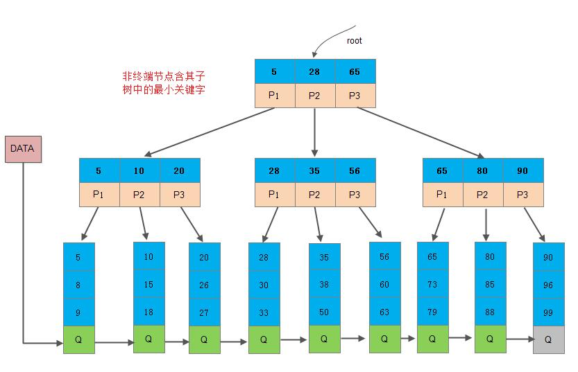

# 1. 语言基础 (C/C++)


# 2. 计网相关


# 3. 数据库
#### （1） 关系型和非关系型数据库的区别（低频）
* 关系型数据库的优点
  1. 容易理解。因为它采用了关系模型来组织数据。
  2. 可以保持数据的一致性。
  3. 数据更新的开销比较小。
  4. 支持复杂查询（带where子句的查询）
* 非关系型数据库的优点
  1. 不需要经过sql层的解析，读写效率高。
  2. 基于键值对，数据的扩展性很好。
  3. 可以支持多种类型数据的存储，如图片，文档等等。
#### （2） 什么是非关系型数据库（低频）
非关系型数据库也叫nosql，采用键值对的形式进行存储。它的读写性能很高，易于扩展。例如Redis,Mongodb,hbase等等。

适合使用非关系型数据库的场景：
* 日志系统
* 地理位置存储
* 数据量巨大
* 高可用
#### （3） 说一下 MySQL 执行一条查询语句的内部执行过程？
* 连接器：客户端先通过连接器连接到 MySQL 服务器。
* 缓存：连接器权限验证通过之后，先查询是否有查询缓存，如果有缓存（之前执行过此语句）则直接返回缓存数据，如果没有缓存则进入分析器。
* 分析器：分析器会对查询语句进行语法分析和词法分析，判断 SQL 语法是否正确，如果查询语法错误会直接返回给客户端错误信息，如果语法正确则进入优化器。
* 优化器：优化器是对查询语句进行优化处理，例如一个表里面有多个索引，优化器会判别哪个索引性能更好。
* 执行器：优化器执行完就进入执行器，执行器就开始执行语句进行查询比对了，直到查询到满足条件的所有数据，然后进行返回。
#### （4） 数据库的索引类型
数据库的索引类型分为逻辑分类和物理分类<br>
逻辑分类：
* 主键索引 当关系表中定义主键时会自动创建主键索引。每张表中的主键索引只能有一个，要求主键中的每个值都唯一，即不可重复，也不能有空值。
* 唯一索引 数据列不能有重复，可以有空值。一张表可以有多个唯一索引，但是每个唯一索引只能有一列。如身份证，卡号等。
* 普通索引 一张表可以有多个普通索引，可以重复可以为空值
* 全文索引 可以加快模糊查询，不常用

物理分类：
* 聚集索引（聚簇索引） 数据在物理存储中的顺序跟索引中数据的逻辑顺序相同，比如以ID建立聚集索引，数据库中id从小到大排列，那么物理存储中该数据的内存地址值也按照从小到大存储。一般是表中的主键索引，如果没有主键索引就会以第一个非空的唯一索引作为聚集索引。一张表只能有一个聚集索引。
* 非聚集索引 数据在物理存储中的顺序跟索引中数据的逻辑顺序不同。非聚集索引因为无法定位数据所在的行，所以需要扫描两遍索引树。第一遍扫描非聚集索引的索引树，确定该数据的主键ID，然后到主键索引（聚集索引）中寻找相应的数据。
#### （5） 说一下事务是怎么实现的
https://blog.csdn.net/u013256816/article/details/103966510

https://www.cnblogs.com/takumicx/p/9998844.html

事务就是一组逻辑操作的集合。实现事务就是要保证可靠性和并发隔离，或者说，能够满足ACID特性的机制。而这些主要是靠日志恢复和并发控制实现的。

* 日志恢复：数据库里有两个日志，一个是redo log，一个是undo log。redo log记录的是已经成功提交的事务操作信息，用来恢复数据，保证事务的**持久性**。undo log记录的是事务修改之前的数据信息，用来回滚数据，保证事务的**原子性**。
* 并发控制：并发控制主要靠读写锁和MVCC（多版本并发控制）来实现。读写锁包括共享锁和排他锁，保证事务的**隔离性**。MVCC通过为数据添加时间戳来实现。

#### （6） MySQL怎么建立索引，怎么建立主键索引，怎么删除索引？
MySQL建立索引有两种方式：用alter table或者create index。
```
alter table table_name add primary key(column_list) #添加一个主键索引
alter table table_name add index (column_list)      #添加一个普通索引
alter table table_name add unique (column_list)     #添加一个唯一索引
```
```
create index index_name on table_name (column_list)   #创建一个普通索引
create unique index_name on table_name (column_list)  #创建一个唯一索引
```

Mysql删除索引同样也有两种方式：alter table 和 drop index
```
alter table table_name drop index index_name    #删除一个普通索引
alter table table_name drop primary key         #删除一个主键索引
```
```
drop index index_name on table table_name
```
#### （7） 索引的优缺点，什么时候使用索引，什么时候不能使用索引（重点）
https://www.cnblogs.com/wezheng/p/8399305.html
* 经常搜索的列上建索引
* 作为主键的列上要建索引
* 经常需要连接（where子句）的列上
* 经常需要排序的列
* 经常需要范围查找的列

哪些列不适合建索引？
* 很少查询的列
* 更新很频繁的列
* 数据值的取值比较少的列（比如性别）
#### （8） 索引的底层实现（重点）
数据库的索引是使用B+树来实现的。

（为什么要用B+树，为什么不用红黑树和B树）<br>
B+树是一种特殊的平衡多路树，是B树的优化改进版本，它把所有的数据都存放在叶节点上，中间节点保存的是索引。这样一来相对于B树来说，减少了数据对中间节点的空间占用，使得中间节点可以存放更多的指针，使得树变得更矮，深度更小，从而减少查询的磁盘IO次数，提高查询效率。另一个是由于叶节点之间有指针连接，所以可以进行范围查询，方便区间访问。

而红黑树是二叉的，它的深度相对B+树来说更大，更大的深度意味着查找次数更多，更频繁的磁盘IO，所以红黑树更适合在内存中进行查找。

#### （9） B树和B+树的区别（重点）


这都是由于B+树和B具有不同的存储结构所造成的区别，以一个m阶树为例。
1. 关键字的数量不同；B+树中分支结点有m个关键字，其叶子结点也有m个，其关键字只是起到了一个索引的作用，但是B树虽然也有m个子结点，但是其只拥有m-1个关键字。
2. 存储的位置不同；B+树中的数据都存储在叶子结点上，也就是其所有叶子结点的数据组合起来就是完整的数据，但是B树的数据存储在每一个结点中，并不仅仅存储在叶子结点上。
3. 分支结点的构造不同；B+树的分支结点仅仅存储着关键字信息和儿子的指针（这里的指针指的是磁盘块的偏移量），也就是说内部结点仅仅包含着索引信息。
4. 查询不同；B树在找到具体的数值以后，则结束，而B+树则需要通过索引找到叶子结点中的数据才结束，也就是说B+树的搜索过程中走了一条从根结点到叶子结点的路径。

B+树优点：由于B+树的数据都存储在叶子结点中，分支结点均为索引，方便扫库，只需要扫一遍叶子结点即可，但是B树因为其分支结点同样存储着数据，我们要找到具体的数据，需要进行一次中序遍历按序来扫，所以B+树更加适合在区间查询的情况，所以通常B+树用于数据库索引，而B树则常用于文件索引。
#### （10） 索引最左前缀/最左匹配
假如我们对a b c三个字段建立了联合索引，在联合索引中，从最左边的字段开始，任何连续的索引都能匹配上，当遇到范围查询的时候停止。比如对于联合索引index(a,b,c),能匹配a,ab,abc三组索引。并且对查询时字段的顺序没有限制，也就是a,b,c; b,a,c; c,a,b; c,b,a都可以匹配。
#### （11） Mysql的优化（高频，索引优化，性能优化）
高频访问：
* 分表分库：将数据库表进行水平拆分，减少表的长度
* 增加缓存： 在web和DB之间加上一层缓存层
* 增加数据库的索引：在合适的字段加上索引，解决高频访问的问题

并发优化：
* 主从读写分离：只在主服务器上写，从服务器上读
* 负载均衡集群：通过集群或者分布式的方式解决并发压力
#### （12） MYSQL数据库引擎介绍，innodb和myisam的特点与区别
* InnoDB ： InnoDB是mysql的默认引擎，支持事务和外键，支持容灾恢复。适合更新频繁和多并发的表  行级锁
* MyISAM ： 插入和查询速度比较高，支持大文件，但是不支持事务，适合在web和数据仓库场景下使用  表级锁
* MEMORY ： memory将表中的数据保存在内存里，适合数据比较小而且频繁访问的场景
* CSV
* blackhole
#### （13） 数据库中事务的ACID（四大特性都要能够举例说明，理解透彻，比如原子性和一致性的关联，隔离性不好会出现的问题）
数据库事务是指逻辑上对数据的一种操作，这个事务要么全部成功，要么全部失败。

**A: atom 原子性**<br>
数据库事务的原子性是指：事务是一个不可分割的工作单位，这组操作要么全部发生，要么全部不发生。

**C: consistency 一致性**<br>
数据库事务的一致性是指：在事务开始以前，数据库中的数据有一个一致的状态。在事务完成后，数据库中的事务也应该保持这种一致性。事务应该将数据从一个一致性状态转移到另一个一致性状态。
比如在银行转账操作后两个账户的总额应当不变。

**I: isolation 隔离性**<br>
数据库事务的隔离性要求数据库中的事务不会受另一个并发执行的事务的影响，对于数据库中同时执行的每个事务来说，其他事务要么还没开始执行，要么已经执行结束，它都感觉不到还有别的事务正在执行。

**D：durability 持久性**<br>
数据库事务的持久性要求事务对数据库的改变是永久的，哪怕数据库发生损坏都不会影响到已发生的事务。
如果事务没有完成，数据库因故断电了，那么重启后也应该是没有执行事务的状态，如果事务已经完成后数据库断电了，那么重启后就应该是事务执行完成后的状态。
#### （14）什么是脏读，不可重复读和幻读？
详见[数据库的事务隔离级别总结](https://blog.csdn.net/fuzhongmin05/article/details/91126936)
* 脏读：脏读是指一个事务在处理过程中读取了另一个还没提交的事务的数据。
  
  > 比如A向B转账100，A的账户减少了100，而B的账户还没来得及修改，此时一个并发的事务访问到了B的账户，就是脏读
* 不可重复读：不可重复读是对于数据库中的某一个字段，一个事务多次查询却返回了不同的值，这是由于在查询的间隔中，该字段被另一个事务修改并提交了。
  > 比如A第一次查询自己的账户有1000元，此时另一个事务给A的账户增加了1000元，所以A再次读取他的账户得到了2000的结果，跟第一次读取的不一样。
  > 不可重复读与脏读的不同之处在于，脏读是读取了另一个事务没有提交的脏数据，不可重复读是读取了已经提交的数据，实际上并不是一个异常现象。
* 幻读：事务多次读取同一个范围的时候，查询结果的记录数不一样，这是由于在查询的间隔中，另一个事务新增或删除了数据。
  > 比如A公司一共有100个人，第一次查询总人数得到100条记录，此时另一个事务新增了一个人，所以下一次查询得到101条记录。
  > 不可重复度和幻读的不同之处在于，幻读是多次读取的结果行数不同，不可重复度是读取结果的值不同。

避免不可重复读需要锁行，避免幻读则需要锁表。

脏读，不可重复读和幻读都是数据库的读一致性问题，是在并行的过程中出现的问题，必须采用一定的隔离级别解决。
详见[脏读、不可重复读和幻读的区别](https://www.cnblogs.com/Hakuna-Matata/p/7772794.html)

#### （15） 数据库的隔离级别，mysql和Oracle的隔离级别分别是什么（重点）
详见[数据库的事务隔离级别总结](https://blog.csdn.net/fuzhongmin05/article/details/91126936)和[数据库隔离级别](https://blog.csdn.net/fg2006/article/details/6937413)

为了保证数据库事务一致性，解决脏读，不可重复读和幻读的问题，数据库的隔离级别一共有四种隔离级别：
* 读未提交 Read Uncommitted: 最低级别的隔离，不能解决以上问题
* 读已提交 Read committed:   可以避免脏读的发生 
* 可重复读 Reapeatable read:  确保事务可以多次从一个字段中读取相同的值，在该事务执行期间，禁止其他事务对此字段的更新，可以避免脏读和不可重复读。 通过锁行来实现 
* 串行化 Serializaion  最严格的事务隔离机制，要求所有事务被串行执行，可以避免以上所有问题。 通过锁表来实现

Oracle的默认隔离级别是**读已提交**，实现了四种隔离级别中的读已提交和串行化隔离级别

MySQL的默认隔离级别是**可重复读**，并且实现了所有四种隔离级别
#### （16） 数据库连接池的作用
#### （17） Mysql的表空间方式，各自特点
* 共享表空间：指的是数据库的所有的表数据，索引文件全部放在一个文件中，默认这个共享表空间的文件路径在 data 目录下。 
* 独立表空间：每一个表都将会生成以独立的文件方式来进行存储。 优点：当表被删除时这部分空间可以被回收；可以更快的恢复和备份单个表；将单个表复制到另一个实例会很方便； 缺点：mysqld会维持很多文件句柄，表太多会影响性能。如果很多表都增长会导致碎片问题
#### （18） 分布式事务
#### （19） 数据库的范式
https://www.cnblogs.com/linjiqin/archive/2012/04/01/2428695.html

* **第一范式(确保每列保持原子性)**<br>
第一范式是最基本的范式。如果数据库表中的所有字段值都是不可分解的原子值，就说明该数据库表满足了第一范式。

>比如 学生 选课（包括很多课程） 就不符合第一范式
* **第二范式(确保表中的每列都和主键相关)**<br>
在满足第一范式的前提下，（主要针对联合主键而言）第二范式需要确保数据库表中的每一列都和主键的所有成员直接相关，由整个主键才能唯一确定，而不能只与主键的某一部分相关或者不相关。 

>比如一张学生信息表，由主键（学号）可以唯一确定一个学生的姓名，班级，年龄等信息。但是主键 （学号，班级） 与列 姓名，班主任，教室 就不符合第二范式，因为班主任跟部分主键（班级）是依赖关系
* **第三范式(确保非主键的列没有传递依赖)**<br>
在满足第二范式的前提下，第三范式需要确保数据表中的每一列数据都和主键直接相关，而不能间接相关。非主键的列不能确定其他列，列与列之间不能出现传递依赖。

>比如一张学生信息表，主键是（学号）列包括 姓名，班级，班主任 就不符合第三范式，因为非主键的列中 班主任 依赖于 班级
* **BCNF范式（确保主键之间没有传递依赖）**<br>
主键有可能是由多个属性组合成的复合主键，那么多个主键之间不能有传递依赖。也就是复合主键之间谁也不能决定谁，相互之间没有关系。
#### （20） 数据的锁的种类，加锁的方式
以MYSQL为例，
* 按照类型来分有乐观锁和悲观锁
* 根据粒度来分有行级锁，页级锁，表级锁（粒度一个比一个大） （仅BDB，Berkeley Database支持页级锁）
* 根据作用来分有共享锁（读锁）和排他锁（写锁）。
#### （21） 什么是共享锁和排他锁
* 共享锁是读操作的时候创建的锁，一个事务对数据加上共享锁之后，其他事务只能对数据再加共享锁，不能进行写操作直到释放所有共享锁。
* 排他锁是写操作时创建的锁，事务对数据加上排他锁之后其他任何事务都不能对数据加任何的锁（即其他事务不能再访问该数据）
  
  https://blog.csdn.net/qq_42743933/article/details/81236658
#### （22） 分库分表的理解和简介
#### （23） 
#### （24）数据库高并发的解决方案
1. 在web服务框架中加入缓存。在服务器与数据库层之间加入缓存层，将高频访问的数据存入缓存中，减少数据库的读取负担。
2. 增加数据库索引。提高查询速度。（不过索引太多会导致速度变慢，并且数据库的写入会导致索引的更新，也会导致速度变慢）
3. 主从读写分离，让主服务器负责写，从服务器负责读。
4. 将数据库进行拆分，使得数据库的表尽可能小，提高查询的速度。
5. 使用分布式架构，分散计算压力。
#### （25）乐观锁与悲观锁解释一下
一般的数据库都会支持并发操作，在并发操作中为了避免数据冲突，所以需要对数据上锁，乐观锁和悲观锁就是两种不同的上锁方式。

悲观锁假设数据在并发操作中一定会发生冲突，所以在数据开始读取的时候就把数据锁住。而乐观锁则假设数据一般情况下不会发生冲突，所以在数据提交更新的时候，才会检测数据是否有冲突。
#### （26）乐观锁与悲观锁是怎么实现的
悲观锁有行级锁和页级锁两种形式。行级锁对正在使用的单条数据进行锁定，事务完成后释放该行数据，而页级锁则对整张表进行锁定，事务正在对该表进行访问的时候不允许其他事务并行访问。

悲观锁要求在整个过程中一直与数据库有一条连接，因为上一个事务完成后才能让下一个事务执行，这个过程是串行的。

乐观锁有三种常用的实现形式：
* 一种是在执行事务时把整个数据都拷贝到应用中，在数据更新提交的时候比较数据库中的数据与新数据，如果两个数据一摸一样则表示没有冲突可以直接提交，如果有冲突就要交给业务逻辑去解决。
* 一种是使用版本戳来对数据进行标记，数据每发生一次修改，版本号就增加1。某条数据在提交的时候，如果数据库中的版本号与自己的一致，就说明数据没有发生修改，否则就认为是过期数据需要处理。
* 最后一种采用时间戳对数据最后修改的时间进行标记。与上一种类似。

#### （27）对数据库目前最新技术有什么了解吗


# 4. Linux


# 5. 操作系统


# 6. 场景题/算法题
#### （0） leetcode hot100至少刷两遍，剑指offer至少刷两遍 重中之重！！
面试中90%的算法题都从leetcode hot100和剑指offer中出 刷两遍非常有必要
#### （1） 介绍熟悉的设计模式（单例，简单工厂模式）
#### （2） 写单例模式，线程安全版本
```C++ version
class Singleton{
  private:
    static Singleton* instance;
    Singleton(){
      // initialize
    }
  public:
    static Singleton* getInstance(){
      if(instance==nullptr) instance=new Singleton();
      return instance;
    }
};
```
#### （3） 写三个线程交替打印ABC
```C++
#include<iostream>
#include<thread>
#include<mutex>
#include<condition_variable>
using namespace std;

mutex mymutex;
condition_variable cv;
int flag=0;

void printa(){
    unique_lock<mutex> lk(mymutex);
    int count=0;
    while(count<10){
        while(flag!=0) cv.wait(lk);
        cout<<"thread 1: a"<<endl;
        flag=1;
        cv.notify_all();
        count++;
    }
    cout<<"my thread 1 finish"<<endl;
}
void printb(){
    unique_lock<mutex> lk(mymutex);
    for(int i=0;i<10;i++){
        while(flag!=1) cv.wait(lk);
        cout<<"thread 2: b"<<endl;
        flag=2;
        cv.notify_all();
    }
    cout<<"my thread 2 finish"<<endl;
}
void printc(){
    unique_lock<mutex> lk(mymutex);
    for(int i=0;i<10;i++){
        while(flag!=2) cv.wait(lk);
        cout<<"thread 3: c"<<endl;
        flag=0;
        cv.notify_all();
    }
    cout<<"my thread 3 finish"<<endl;
}
int main(){
    thread th2(printa);
    thread th1(printb);
    thread th3(printc);

    th1.join();
    th2.join();
    th3.join();
    cout<<" main thread "<<endl;


}
```
#### （4） 二维码登录的实现过程 场景题

#### （5） 不使用临时变量实现swap函数
* 使用异或/加减等方式，下面给出使用异或的实现方法
```C++
void swap(int& a,int& b){
  a=a^b;
  b=a^b;
  a=a^b;
}
```
#### （6） 实现一个strcpy函数（或者memcpy），如果内存可能重叠呢
#### （7） 实现快排
```C++
void swap(vector<int>& vec,int a,int b){
    vec[a]=vec[a]^vec[b];
    vec[b]=vec[a]^vec[b];
    vec[a]=vec[a]^vec[b];
}
int partition(vector<int>& vec,int start,int end){
    int pivot=vec[start+(end-start)/2];
    while(start<end){
        while(start<end and vec[start]<pivot) start++;
        while(start<end and vec[end]>pivot) end--;
        if(start<end) swap(vec,start,end);
    }
    return start;
}
void quickSort(vector<int>& vec,int start,int end){
    if(start>end) return;
    int pivot=partition(vec,start,end);
    quickSort(vec,start,pivot-1);
    quickSort(vec,pivot+1,end);
}
```
#### （8） 实现一个堆排序
堆排序的基本过程：
* 将n个元素的序列构建一个大顶堆或小顶堆
* 将堆顶的元素放到序列末尾
* 将前n-1个元素重新构建大顶堆或小顶堆，重复这个过程，直到所有元素都已经排序

整体时间复杂度为nlogn
```C++
#include<iostream>
#include<vector>
using namespace std;
void swap(vector<int>& arr, int a,int b){
    arr[a]=arr[a]^arr[b];
    arr[b]=arr[a]^arr[b];
    arr[a]=arr[a]^arr[b];
}
void adjust(vector<int>& arr,int len,int index){
    int maxid=index;
    // 计算左右子节点的下标   left=2*i+1  right=2*i+2  parent=(i-1)/2
    int left=2*index+1,right=2*index+2;

    // 寻找当前以index为根的子树中最大/最小的元素的下标
    if(left<len and arr[left]<arr[maxid]) maxid=left;
    if(right<len and arr[right]<arr[maxid]) maxid=right;

    // 进行交换，记得要递归进行adjust,传入的index是maxid
    if(maxid!=index){
        swap(arr,maxid,index);
        adjust(arr,len,maxid);
    }
}
void heapsort(vector<int>&arr,int len){
    // 初次构建堆，i要从最后一个非叶子节点开始，所以是(len-1-1)/2，0这个位置要加等号
    for(int i=(len-1-1)/2;i>=0;i--){
        adjust(arr,len,i);
    }

    // 从最后一个元素的下标开始往前遍历，每次将堆顶元素交换至当前位置，并且缩小长度（i为长度），从0处开始adjust
    for(int i=len-1;i>0;i--){
        swap(arr,0,i);
        adjust(arr,i,0);// 注意每次adjust是从根往下调整，所以这里index是0！
    }
}
int main(){
    vector<int> arr={3,4,2,1,5,8,7,6};

    cout<<"before: "<<endl;
    for(int item:arr) cout<<item<<" ";
    cout<<endl;

    heapsort(arr,arr.size());

    cout<<"after: "<<endl;
    for(int item:arr)cout<<item<<" ";
    cout<<endl;

    return 0;
}
```
#### （8） 实现一个插入排序
https://blog.csdn.net/left_la/article/details/8656425

```C++
void insertSort(vector<int>& nums){
  int len=nums.size();
  for(int i=1;i<len;i++){
    int key=nums[i];
    int j=i-1;
    while(j>=0 and nums[j]>key){
      nums[j+1]=nums[j];
      j--;
    }
    nums[j+1]=key;
  }
}
```

#### （9） 快排存在的问题，如何优化
* 3 种快排基准选择方法：

随机（rand函数）、固定（队首、队尾）、三数取中（队首、队中和队尾的中间数）

* 4种优化方式：

优化1：当待排序序列的长度分割到一定大小后，使用插入排序

优化2：在一次分割结束后，可以把与Key相等的元素聚在一起，继续下次分割时，不用再对与key相等元素分割

优化3：优化递归操作

优化4：使用并行或多线程处理子序列
#### （10） 反转一个链表（招银网络二面）
```C++
ListNode* reverse(ListNode* root){
  ListNode* pre=nullptr,cur=root,nxt;
  while(cur!=nullptr){
    nxt=cur->next;
    cur->next=pre;
    pre=cur;cur=nxt;
  }
  return pre;
}
```
#### （11） Top K问题（可以采取的方法有哪些，各自优点？）（重点）
*Top K 问题的常见形式：*
>给定10000个整数，找第K大（第K小）的数<br>
 给定10000个整数，找出最大（最小）的前K个数<br>
给定100000个单词，求前K词频的单词<br>

*解决Top K问题若干种方法*
* 使用最大最小堆。求最大的数用最小堆，求最小的数用最大堆。
* Quick Select算法。使用类似快排的思路，根据pivot划分数组。
* 使用排序方法，排序后再寻找top K元素。
* 使用选择排序的思想，对前K个元素部分排序。
* 将1000.....个数分成m组，每组寻找top K个数，得到m×K个数，在这m×k个数里面找top K个数。

1. 使用最大最小堆的思路 （以top K 最大元素为例）<br>
按顺序扫描这10000个数，先取出K个元素构建一个大小为K的最小堆。每扫描到一个元素，如果这个元素大于堆顶的元素（这个堆最小的一个数），就放入堆中，并删除堆顶的元素，同时整理堆。如果这个元素小于堆顶的元素，就直接pass。最后堆中剩下的元素就是最大的前Top K个元素，最右的叶节点就是Top 第K大的元素。

>note：最小堆的插入时间复杂度为log(n)，n为堆中元素个数，在这里是K。最小堆的初始化时间复杂度是nlog(n)

C++中的最大最小堆要用标准库的priority_queue来实现。
```C++
struct Node {
    int value;
    int idx;
    Node (int v, int i): value(v), idx(i) {}
    friend bool operator < (const struct Node &n1, const struct Node &n2) ; 
};

inline bool operator < (const struct Node &n1, const struct Node &n2) {
    return n1.value < n2.value;
}

priority_queue<Node> pq; // 此时pq为最大堆
```

2. 使用Quick Select的思路（以寻找第K大的元素为例）<br>
Quick Select脱胎于快速排序，提出这两个算法的都是同一个人。算法的过程是这样的：
首先选取一个枢轴，然后将数组中小于该枢轴的数放到左边，大于该枢轴的数放到右边。
此时，如果左边的数组中的元素个数大于等于K，则第K大的数肯定在左边数组中，继续对左边数组执行相同操作；
如果左边的数组元素个数等于K-1，则第K大的数就是pivot；
如果左边的数组元素个数小于K，则第K大的数肯定在右边数组中，对右边数组执行相同操作。

这个算法与快排最大的区别是，每次划分后只处理左半边或者右半边，而快排在划分后对左右半边都继续排序。
```
//此为Java实现
public int findKthLargest(int[] nums, int k) {
  return quickSelect(nums, k, 0, nums.length - 1);
}

// quick select to find the kth-largest element
public int quickSelect(int[] arr, int k, int left, int right) {
  if (left == right) return arr[right];
  int index = partition(arr, left, right);
  if (index - left + 1 > k)
    return quickSelect(arr, k, left, index - 1);
  else if (index - left + 1 == k)
    return arr[index];
  else
    return quickSelect(arr, k - (index - left + 1), index + 1, right);

}
```

3. 使用选择排序的思想对前K个元素排序 （ 以寻找前K大个元素为例）<br>
扫描一遍数组，选出最大的一个元素，然后再扫描一遍数组，找出第二大的元素，再扫描一遍数组，找出第三大的元素。。。。。以此类推，找K个元素，时间复杂度为O(N*K)
#### （12） 8G的int型数据，计算机的内存只有2G，怎么对它进行排序？（外部排序）（百度一面）
我们可以使用外部排序来对它进行处理。首先将整个文件分成许多份，比如说m份，划分的依据就是使得每一份的大小都能放到内存里。然后我们用快速排序或者堆排序等方法对每一份数据进行一个内部排序，变成有序子串。接着对这m份有序子串进行m路归并排序。取这m份数据的最小元素，进行排序，输出排序后最小的元素到结果中，同时从该元素所在子串中读入一个元素，直到所有数据都被输出到结果中为止。

https://blog.csdn.net/ailunlee/article/details/84548950

#### （13） 自己构建一棵二叉树，使用带有null标记的前序遍历序列
在写二叉树相关算法的时候，如果需要自己构造测试用例（自己构造一棵二叉树），往往是一件很麻烦的事情，我们可以用一个带有null标记的前序遍历序列来进行构造。 **需要注意的是vec2tree()参数中的start是引用传递，而不是简单的参数值传递**。
```C++
#include<iostream>
#include<vector>
#include<queue>
using namespace std;

struct treeNode{
    string val;
    treeNode* left,*right;
    treeNode(string val):val(val){
        left=nullptr;
        right=nullptr;
    }
};

treeNode* vec2tree(vector<string>& vec,int& start){
    treeNode* root;
    if(vec[start]=="null"){
        start+=1;
        root=nullptr;
    }else{
        root=new treeNode(vec[start]);
        start+=1;
        root->left=vec2tree(vec,start);
        root->right=vec2tree(vec,start);
    }
    return root;
}

void tree2vec(treeNode *root,vector<string>& vec){
    if(root==nullptr){
        vec.push_back("null");
    }else{
        vec.push_back(root->val);
        tree2vec(root->left,vec);
        tree2vec(root->right,vec);
    }
}

int main(){
    vector<string> vec={"2","4","5","7","null","null","null","null","3","6","null","null","2","null","null"};
    int index=0,&start=index;
    treeNode* root=vec2tree(vec,start);
    //displaytree(root);
    vector<string> mvec;
    tree2vec(root,mvec);
    for(string item:mvec) cout<<item<<" ";
    cout<<endl;
    return 0;
```
#### （14） 介绍一下b树和它的应用场景有哪些
B树也叫做B-树，或者平衡多路树，它是每个节点最多有m个子树的**平衡树**。一个m阶的B树具有如下几个特征：
1. 根结点至少有两个子女。
2. 每个中间节点都包含至多m个子树 ， 每个节点包含的元素个数是其子树个数-1（其中 m/2 <= k <= m）
3. 所有的叶子结点都位于同一层。
4. 每个节点中的元素从小到大排列，节点当中k-1个元素正好是k个子树包含的元素的值域分划。

b树主要应用于文件系统中，在数据库中（mongoDB）也有应用，与B+树相比好处应该是有时不需要访问到叶节点就可以获取数据。

查询时间复杂度是logN
#### （15） 介绍一下b+树和它的应用场景有哪些
B+树是一种特殊的B树，它把数据都存储在叶子节点，并且叶节点间有指针连接。内部只存关键字（其中叶子节点的最小值作为索引）和孩子指针，简化了内部节点。

应用场景主要是数据库的索引

查询时间复杂度也是logN
https://zhuanlan.zhihu.com/p/110202102

https://blog.csdn.net/hguisu/article/details/7786014
#### （16） 介绍一下红黑树和它的应用场景有哪些
红黑树是一种特殊的二叉查找树，它在每一个节点上都使用红色或黑色进行标记，通过一些性质确保它是始终平衡的。
它的性质是这样的：
1. 每个节点不是红色就是黑色。
2. 根节点是黑色的。
3. 叶节点的空节点是黑色的。
4. 如果一个节点是红色的，那么它的两个子节点是黑色的。
5. 对于任意节点，从它到叶节点的每条路径上都有相同数目的黑色节点。

红黑树的插入，查询，删除在一般情况和最坏情况下的时间复杂度都是O(log(n))

应用场景主要是STL中map，set的实现，优点在于支持频繁的修改，因为查询删除插入时间复杂度都是logN

#### （17） 怎么写sql取表的前1000行数据（招银网络二面）
```sql
select * limit 1000
from t1
```
#### （18） N个骰子出现和为m的概率
#### （19） 海量数据问题（可参考左神的书）
#### （20） 一致性哈希
#### （21）希尔排序说一下/手撕
https://www.cnblogs.com/chengxiao/p/6104371.html
希尔排序是把记录按下标的一定增量分组，对每组使用直接插入排序算法排序；随着增量逐渐减少，每组包含的关键词越来越多，当增量减至1时，整个文件恰被分成一组，算法便终止。
#### （22）Dijkstra算法说一下
#### （23）实现一个动态数组要怎么实现，说思路（腾讯teg一面）
模拟STL中vector的实现即可，去看一下vector的源码。
#### （24）最小生成树算法说一下
#### （25） 海量数据的bitmap使用原理
bitmap算法就是使用一个比特映射一个值，它可以用在整数排序和数据压缩上，因为使用一个比特位去存储一个数，所以它可以大大节省空间。

它的具体过程是：先根据数组中元素最大的数N计算需要分配多大的空间。
如果使用int型数组的形式来保存的话，一个int = 4字节  =4*8比特 = 32比特。也就是一个int数可以映射32个数据（图1），然后需要找到最大的数Max，表示最多需要的位数，所以需要开辟的数组空间为int a[1+Max/32]。
然后需要推导一个整数a内如何映射32个数据，方法是将待存储的数据模32，然后将a中相应位置的比特置为1。
依此方法映射每一个元素，待读取的时候扫描每个比特位，遇到值为1的就还原该数字。


**移位计算公式：**
N/32就是将N的二进制右移log32（也就是5）位 ： N>>5<br>
N%32就是求N的后5位：N& 0x1F  (0x1F = 00011111)<br>
模32然后相应位置置为1： a[i] |= 1<< N & 0x1F<br>

所以总的公式为： a[ N>>5 ] |= 1<< N & 0x1F<br>

**BitMap算法评价**
* 优点：
    1. 运算效率高，不进行比较和移位；
    2. 占用内存少，比如最大的数MAX=10000000；只需占用内存为MAX/8=1250000Byte=1.25M。
* 缺点：
    1. 所有的数据不能重复，即不可对重复的数据进行排序。（少量重复数据查找还是可以的，用2-bitmap）。
    2. 所需要的空间随着最大元素的增大而增大，当数据类似（1，1000，10万）只有3个数据的时候，用bitmap时间复杂度和空间复杂度相当大，只有当数据比较密集时才有优势。

#### （26） 布隆过滤器原理与优点
布隆过滤器是一个比特向量或者比特数组，它本质上是一种概率型数据结构，用来查找一个元素是否在集合中，支持高效插入和查询某条记录。常作为针对超大数据量下高效查找数据的一种方法。

**它的具体工作过程是这样子的：**
假设布隆过滤器的大小为m（比特向量的长度为m），有k个哈希函数，它对每个数据用这k个哈希函数计算哈希，得到k个哈希值，然后将向量中相应的位设为1。在查询某个数据是否存在的时候，对这个数据用k个哈希函数得到k个哈希值，再在比特向量中相应的位查找是否为1，如果某一个相应的位不为1，那这个数据就肯定不存在。但是如果全找到了，则这个数据有可能存在。

**为什么说有可能存在呢？**
因为不同的数据经过哈希后可能有相同的哈希值，在比特向量上某个位置查找到1也可能是由于某个另外的数据映射得到的。

**支持删除操作吗**
目前布隆过滤器只支持插入和查找操作，不支持删除操作，如果要支持删除，就要另外使用一个计数变量，每次将相应的位置为1则计数加一，删除则减一。

布隆过滤器中哈希函数的个数需要选择。如果太多则很快所有位都置为1，如果太少会容易误报。

**布隆过滤器的大小以及哈希函数的个数怎么选择？**
k 为哈希函数个数，m 为布隆过滤器长度，n 为插入的元素个数，p 为误报率

#### （27） 布隆过滤器处理大规模问题时的持久化，包括内存大小受限、磁盘换入换出问题
#### （28）实现一个队列，并且使它支持多线程，队列有什么应用场景（阿里三面）
```C++
//评测题目: 
class FIFOQueue
{
vector<int> vec(initCap,0);
int start=0,end=0;
condition_variable cv;
mutex m;
bool flag=false;// isFull
  bool enqueue(int v) {
  	unique_lock<mutex></mutex> lk(m);
    while(flag==true) cv.wait(lk);
        end=(end+1)%initCap;
        vec[end]=v;
        cv.notifyall();
        return true;
    }
  }
  int dequeue() {
  unique_lock<mutex></mutex> lk(m);
  	if(start!=end){
    	int val = vec[start];
    	start=(start+1)%initCap;
        flag=false;
    	cv.notifyall();
        return val;
    }else{
    	flag=false;
    	cv.notifyall();
    	return -1;
  	}
  }
}
```
以上代码是面试时写的，并没有运行，也许有错误，请客观参考
# 7. 智力题
#### （1） 100层楼，只有2个鸡蛋，想要判断出那一层刚好让鸡蛋碎掉，给出策略（滴滴笔试中两个铁球跟这个是一类题）
* （给定了楼层数和鸡蛋数的情况）二分法+线性查找  从100/2=50楼扔起，如果破了就用另一个从0扔起直到破。如果没破就从50/2=25楼扔起，重复。
* 动态规划
#### （2） 毒药问题，1000瓶水，其中有一瓶可以无限稀释的毒药，要快速找出哪一瓶有毒，需要几只小白鼠
用二进制的思路解决问题。2的十次方是1024，使用十只小鼠喝一次即可。方法是先将每瓶水编号，同时10个小鼠分别表示二进制中的一个位。将每瓶水混合到水瓶编号中二进制为1的小鼠对应的水中。喝完后统计，将死亡小鼠对应的位置为1，没死的置为0，根据死亡小鼠的编号确定有毒的是哪瓶水，如0000001010表示10号水有毒。
#### （3） 
#### （4） 先手必胜策略问题：100本书，每次能够拿1-5本，怎么拿能保证最后一次是你拿
寻找每个回合固定的拿取模式。最后一次是我拿，那么上个回合最少剩下6本。那么只要保持每个回合结束后都剩下6的倍数，并且在这个回合中我拿的和对方拿的加起来为6（这样这个回合结束后剩下的还是6的倍数），就必胜。关键是第一次我必须先手拿（100%6=4）本（这不算在第一回合里面）。
#### （5） 放n只蚂蚁在一条树枝上，蚂蚁与蚂蚁之间碰到就各自往反方向走，问总距离或者时间。
碰到就当没发生，继续走，相当于碰到的两个蚂蚁交换了一下身体。其实就是每个蚂蚁从当前位置一直走直到停止的总距离或者时间。
#### （6） 瓶子换饮料问题：1000瓶饮料，3个空瓶子能够换1瓶饮料，问最多能喝几瓶
拿走3瓶，换回1瓶，相当于减少2瓶。但是最后剩下4瓶的时候例外，这时只能换1瓶。所以我们计算1000减2能减多少次，直到剩下4.（1000-4=996，996/2=498）所以1000减2能减498次直到剩下4瓶，最后剩下的4瓶还可以换一瓶，所以总共是1000+498+1=1499瓶。
#### （7）在24小时里面时针分针秒针可以重合几次
24小时中时针走2圈，而分针走24圈，时针和分针重合24-2=22次，而只要时针和分针重合，秒针一定有机会重合，所以总共重合22次
#### （8） 有一个天平，九个砝码，一个轻一些，用天平至少几次能找到轻的？
至少2次：第一次，一边3个，哪边轻就在哪边，一样重就是剩余的3个；
第二次，一边1个，哪边轻就是哪个，一样重就是剩余的那个；
#### （9） 有十组砝码每组十个，每个砝码重10g，其中一组每个只有9g，有能显示克数的秤最少几次能找到轻的那一组砝码？
砝码分组1~10，第一组拿一个，第二组拿两个以此类推。。第十组拿十个放到秤上称出克数x，则y = 550 - x，第y组就是轻的那组
#### （10）生成随机数问题：给定生成1到5的随机数Rand5()，如何得到生成1到7的随机数函数Rand7()？
思路：由大的生成小的容易，比如由Rand7()生成Rand5()，所以我们先构造一个大于7的随机数生成函数。
记住下面这个式子：
```
RandNN= N( RandN()-1 ) + RandN() ;// 生成1到N^2之间的随机数
可以看作是在数轴上撒豆子。N是跨度/步长，是RandN()生成的数的范围长度，RandN()-1的目的是生成0到N-1的数，是跳数。后面+RandN()的目的是填满中间的空隙
```
比如` Rand25= 5( Rand5()-1 ) + Rand5()`可以生成1到25之间的随机数。我们可以只要1到21（3*7）之间的数字，所以可以这么写
```
int rand7(){
  int x=INT_MAX;
  while(x>21){
    x=5*(rand5()-1)+rand5();
  }
  return x%7+1;
}
```
#### 赛马：有25匹马，每场比赛只能赛5匹，至少要赛多少场才能找到最快的3匹马？
* 第一次，分成5个赛道ABCDE，每个赛道5匹马，每个赛道比赛一场，每个赛道的第12345名记为 A1,A2,A3,A4,A5  B1,B2,B3,B4,B5等等，这一步要赛5场。 
* 第二次，我们将每个赛道的前三名，共15匹。分成三组，然后每组进行比赛。这一步要赛3场。
* 第三次，我们取每组的前三名。共9匹，第一名赛道的马编号为1a,1b,1c，第二名赛道的马编号为2a,2b,2c，第三名赛道的马编号为3a,3b,3c。这时进行分析，1a表示第一名里面的第一名，绝对是所有马中的第一，所以不用再比了。2c表示第二名的三匹里头的最后一匹，3b和3c表示第三名里面的倒数两匹，不可能是所有马里面的前三名，所以也直接排除，剩下1b,1c,2a,2b,,3a，共5匹，再赛跑一次取第一第二名，加上刚筛选出来的1a就是所有马里面的最快3匹了。这一步要赛1场。
* 所以一共是5+3+1=9场。
#### 烧 香/绳子/其他 确定时间问题：有两根不均匀的香，燃烧完都需要一个小时，问怎么确定15分钟的时长？
（说了求15分钟，没说开始的15分钟还是结束的15分钟，这里是可以求最后的15分钟）点燃一根A，同时点燃另一根B的两端，当另一根B烧完的时候就是半小时，这是再将A的另一端也点燃，从这时到A燃烧完就正好15分钟。

#### 掰巧克力问题 N*M块巧克力，每次掰一块的一行或一列，掰成1*1的巧克力需要多少次？（1000个人参加辩论赛，1V1，输了就退出，需要安排多少场比赛）
每次拿起一块巧克力，掰一下（无论横着还是竖着）都会变成两块，因为所有的巧克力共有N\*M块，所以要掰N\*M-1次，-1是因为最开始的一块是不用算进去的。

每一场辩论赛参加两个人，消失一个人，所以可以看作是每一场辩论赛减少一个人，直到最后剩下1个人，所以是1000-1=999场。
# 8. 大数据
#### 1. 介绍一下Hadoop
Hadoop是一套大数据解决方案，提供了一套分布式的系统基础架构，包括HDFS，MapReduce和YARN。
* HDFS提供分布式的数据存储
* MapReduce负责进行数据运算 
* YARN负责任务调度

HDFS是主从架构的，包括namenode，secondarynamenode和datanode。datanode负责存储数据，namenode负责管理HDFS的目录树和文件元信息。<br>
MapReduce包括jobtracker,tasktracker和client。Jobtracker负责进行资源调度和作业监控。tasktracker会周期性的通过心跳向jobtracker汇报资源使用情况。
#### 2. 说一下MapReduce的运行机制
MapReduce包括输入分片、map阶段、combine阶段、shuffle阶段和reduce阶段。分布式计算框架包括client，jobtracker和tasktracker和调度器。
* 输入分片阶段，mapreduce会根据输入文件计算分片，每个分片对应一个map任务
* map阶段会根据mapper方法的业务逻辑进行计算，映射成键值对
* combine阶段是在节点本机进行一个reduce，减少传输结果对带宽的占用
* shuffle阶段是对map阶段的结果进行分区，排序，溢出然后写入磁盘。将map端输出的无规则的数据整理成为有一定规则的数据，方便reduce端进行处理，有点像洗牌的逆过程。  https://blog.csdn.net/ASN_forever/article/details/81233547
* reduce阶段是根据reducer方法的业务逻辑进行计算，最终结果会存在hdfs上。

#### 3. 介绍一下kafka
https://blog.csdn.net/qq_29186199/article/details/80827085

https://blog.csdn.net/student__software/article/details/81486431

kafka是一个分布式消息队列，包括producer、broker和consumer。kafka会对每个消息根据topic进行归类，每个topic又会分成多个partition，消息会根据先进先出的方式存储。消费者通过offset进行消费。 

kafka的特点是吞吐量高，可以进行持久化，高可用。
#### 4. 为什么kafka吞吐量高？/介绍一下零拷贝
kafka吞吐量高是因为一个利用了磁盘顺序读写的特性，速度比随机读写要快很多，另一个是使用了零拷贝，数据直接在内核进行输入和输出，减少了用户空间和内核空间的切换。

零拷贝：传统文件读取并发送至网络的步骤是：先将文件从磁盘拷贝到内核空间，然后内核空间拷贝到用户空间的缓冲区，再从用户空间拷贝到内核空间的socket缓冲区，最后拷贝到网卡并发送。而零拷贝技术是先将文件从磁盘空间拷贝到内核缓冲区，然后直接拷贝至网卡进行发送，减少了重复拷贝操作。
#### 5. 介绍一下spark
https://blog.csdn.net/u011204847/article/details/51010205

spark是一个通用内存并行计算框架。它可以在内存中对数据进行计算，效率很高，spark的数据被抽象成RDD（弹性分布式数据集）并且拥有DAG执行引擎，兼容性和通用性很好。可以和Hadoop协同工作。
#### 6. 介绍一下spark-streaming
https://blog.csdn.net/yu0_zhang0/article/details/80569946

spark-streaming是spark的核心组件之一。主要提供高效的流计算能力。spark-streaming的原理是将输入数据流以时间片进行拆分，然后经过spark引擎以类似批处理的方式处理每个时间片数据。

spark-streaming将输入根据时间片划分成一段一段的Dstream（也就是离散数据流），然后将每一段数据转换成RDD进行操作。 

#### 7. spark的transformation和action有什么区别
spark的算子分成transformation和action两类
* transformation是变换算子，这类算子不会触发提交，是延迟执行的。也就是说执行到transformation算子的时候数据并没有马上进行计算，只是记住了对RDD的逻辑操作 
* action算子是执行算子，会出发spark提交作业，并将数据输出到spark
#### 8. spark常用的算子说几个
spark的算子分为两类：transformation和action

常用的transformation算子：
```scala
// union 求并集
val rdd8 = rdd6.union(rdd7)

// intersection 求交集 
val rdd9 = rdd6.intersection(rdd7)

// join 将rdd进行聚合连接，类似数据库的join 
val rdd3 = rdd1.join(rdd2)

// map flatMap mapPartition 传入一个函数对数据集中的每一个数据进行操作 
val arr1 = Array(1,2,3,4,5)
val arr2 = rdd1.map(_+1)

// countByKey reduceByKey partitionByKey 统计每个key有多少个键值对 
```
常用的action算子
```scala
// reduce 按照一定的方法将元素进行合并 
val rdd2 = rdd1.reduce(_+_)

// collect 将RDD转换为数组
rdd1.collect

// top 返回最大的k个元素
rdd1.top(2)
```
#### 9. 如何保证kafka的消息不丢失
https://blog.csdn.net/liudashuang2017/article/details/88576274

我们可以从三个方面保证kafka不丢失消息
* 首先从producer生产者方面，为send()方法注册一个回调函数，可以得知消息发送有没有成功；将重试次数retrie设置为3；设置acks参数为all，当消息被写入所有同步副本之后才算发送成功。
* 在consumer消费者方面，关闭自动提交；
* 在broker集群方面，设置复制系数replica.factor为大于等于3
#### 10. kafka如何选举leader
首先启动的broker在zookeeper中创建一个临时节点并让自己称为leader，其他的节点会创建watch对象进行监听并成为follower，当broker宕机的时候，其他follower会尝试创建这个临时节点，但是只有一个能够创建成功，创建成功的broker就会成为leader。


#### 11. 说下spark中的宽依赖和窄依赖
https://blog.csdn.net/a1043498776/article/details/54889922

* 宽依赖：指子RDD的分区依赖于父RDD的所有分区，举例：groupbykey,join
* 窄依赖：指父RDD的每个分区被最多一个子RDD的分区所依赖,举例：map，filter

#### 12. 说下spark中stage是依照什么划分的
https://zhuanlan.zhihu.com/p/57124273

spark中的stage其实是一组并行的任务，spark会将多个RDD根据依赖关系划分成有向无环图DAG，DAG会被划分成多个stage，划分的依据是RDD之间的宽窄依赖。遇到宽依赖就划分stage。因为宽依赖与窄依赖的区别之一就是宽依赖会发生shuffle操作，所以也可以说stage的划分依据是是否发生shuffle操作。

#### 13. spark的内存管理是怎样的
https://www.jianshu.com/p/4f1e551553ae 

https://www.cnblogs.com/wzj4858/p/8204282.html

spark的内存包括静态内存管理和统一内存管理两种机制。静态内存管理中存储和执行两块内存区域是分开的，统一内存管理中两块内存之间可以相互借用<br>
* 静态内存管理：静态内存管理机制下堆内内存包括安全内存，存储内存，shuffle内存和unroll内存


  * 统一内存管理：统一内存管理机制下内存分为spark内存，用户内存和保留内存三部分。用户内存存放用户代码逻辑和自定义数据结构等，保留内存存放的是spark的内部对象和逻辑。
    

#### 14. spark的容错机制是什么样的
https://blog.csdn.net/dengxing1234/article/details/73613484

spark的容错机制是通过血统（lineage）和checkpoint来实现的 。

* RDD的lineage可以看作是一个重做日志（redo log）记录的是它粗粒度上的transformation操作。当rdd的分区数据丢失时，它可以根据lineage重新计算来恢复数据。 在窄依赖上可以直接计算父RDD的节点数据进行恢复，在宽依赖上则要等到父RDD所有数据计算完后并将结果shuffle到子RDD上才能完成恢复。
* 如果DAG中的lineage过长，或者在宽依赖上进行checkpoint的收益更大，就会使用checkpoint进行容错，将RDD写入磁盘进行持久化存储，如果节点数据丢失，就从磁盘读取数据进行恢复。


# 9. HR面
#### 1. 自我介绍
（HR面试的自我介绍可以侧重软实力部分，项目技术方面介绍可以适当少一些）
#### 2. 项目中遇到的最大难点
* 在项目中曾经遇到了新的框架不知道该如何上手的问题，以及面对新的概念，新的技术不知道从何学起。解决的办法是在官网寻找说明文档和demo，按照说明文档上的内容一步步了解，以及咨询身边有用过这个框架的同学，或者在CSDN上寻找相关博客。

* 项目的时间比较紧迫，没有那么多的时间可以用。解决方法是把还没有完成的项目分一个轻重缓急，在有限的时间里，先做重要而且紧急的，然后完成紧急的，再做重要的。利用轻重缓急做一个取舍。
#### 3. 项目中的收获
一个是了解了相关框架的使用方法（比如Dataframe的使用，xgboost的使用等等），这些框架或者技术可以在以后的开发中使用到。和对自己开发能力的锻炼。

一个是锻炼了与他人的交流能力，因为在团队项目里经常会跟别人汇报自己的想法和进度，同时也会跟其他成员沟通模块之间的交互，所以在这个过程中对自己的表达能力和理解能力都是一个很大的提升。
#### 4. 可以实习的时间，实习时长
一定要往长了说！半年起步，最好七八个月，因为实习生是可以随时跑路的。而且实习时间越长HR越青睐。
#### 5. 哪里人
#### 6. 说一下自己的性格
我是比较内向谨慎的人，平时做的多说的少。比较善于总结，在与人交流的时候更倾向于倾听别人的意见后才发言。并且别人都说我办事认真靠谱。
#### 7. 你的优缺点是什么
我的缺点是容易在一些细节的地方花费太多的时间，有时候过分追求细节。并且我的实习经验比较缺乏，对于实际项目的业务流程和工作流程不是很了解。（所以我打算通过实习来熟悉实际的软件开发的流程和技术。）

我的优点是责任心比较强，做事比较负责，在校期间我负责的大创项目进展很顺利，我经常组织组员们进行讨论和推进项目的开发，最后这个项目得到了92的评分，在同级别里面是比较高的。
#### 8. 有什么兴趣爱好，画的怎么样/球打的如何/游戏打的怎么样
平时的爱好是画画打游戏，在CSDN写写博客，还有就是看书，我很喜欢学到新知识掌握新技能的感觉。
#### 9. 看过最好的一本书是什么
技术类：编程之美 机器学习西瓜书 STL源码剖析 剑指offer C++primer plus

非技术类：明朝那些事儿 香水（聚斯金德） 解忧杂货店 人类简史 沉默的大多数 与时间做朋友（李笑来） 千年历史千年诗
#### 10. 学习技术中有什么难点
#### 11. 怎么看待加班
我觉得 任何一家单位都有可能要加班。如果自己的工作没有按时完成，那自觉加班是理所当然的，当然，自己要不断提高工作效率，避免这种原因导致的加班。如果遇到紧急任务或者突发状况时，为了顺利配合团队完成任务，我会尽自己所能加班共同完成。
#### 12. 觉得深圳怎么样（或者其他地点）
#### 13. 遇见过最大的挫折是什么，怎么解决的

#### 14. 职业规划
在工作的第一个阶段，先尽快适应工作的环境，包括开发环境开发工具和工作流程等，把自己负责的部分快速的完成，不能出差错。第二个阶段要熟悉整个项目的业务流程，所有模块的结构和依赖关系，知道每个模块为什么要这么设计，以及它们的实现细节。第三个阶段要培养独立设计一个项目的能力，可以独立或者在别人的协作下设计项目的模块分工和架构。

在工作和项目中多写博客或者笔记，积累技术影响力，将经验总结成文档。同时与同事搞好关系，尝试培养领导能力和组织能力。

#### 15. 目前的offer情况
可以如实说
#### 16. 你最大的优势和劣势是什么
* 优势：做事情有主动性，不拖沓，有责任心。举个例子：在做论文课题的时候，几乎都是我自己找老师汇报进度和找老师讨论问题，很少有被老师催的时候。每一次跟老师讨论之后都会将讨论的内容和老师提出的意见进行详细记录。在中软杯的比赛中，主动承担答辩ppt的制作，并且每次排练之后都迅速对ppt的修改意见进行落实修改，前前后后改了十几版。
* 劣势：有时候做事情比较急躁，容易导致粗心。
#### 17. 介绍在项目里面充当的角色
#### 18. 介绍一下本科获得的全国赛奖项的情况
#### 19. 最有成就感的事情/最骄傲的一件事情
* 本科的时候跟优秀的队友们一起参加中国软件杯比赛努力了四个月，最后获得了该赛题的第一名和全国一等奖的好成绩
* 保研夏令营拿到了四个学校的offer
#### 20. 在实验室中担任什么角色，参加的XXX能聊聊吗
#### 22. 用两个词来形容自己
踏实 认真